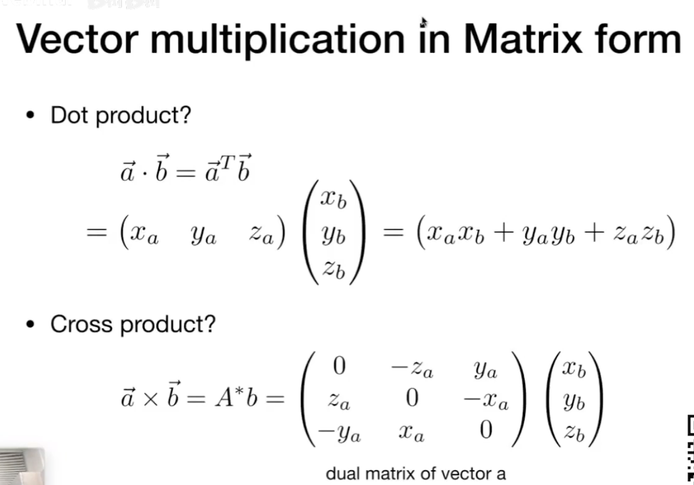

# Lecture02 Review of Linear Gebra

## Graphics'Dependencies
1. Basic mathematics
   - Linear algebra
   - calculus
   - statistics 

2. Basic physics
    - Optics
    - Mechanics

3. Misc
    - signal processing
    - Numerical analysis

4. a bit of aesthetics
   

## More dependent on Linear Algebra
### 1. Vectors
   - usually written as **a** 
   - or using start and end points **AB**
   - Direction and length
   - No absolute starting position
    
   1. vector Normalization
       - magnitude (length) of a vector written as ||**a**||
       - Unit vector: a vector with magnitude of 1
       - used to represent directions
   2. vector addition: Parallelogram law & Triangle law
   3. vector multiplition
       - dot product: find angles/projections   a•b
       - cross product: 
            - find orthogonal vectors  axb
            - 右手系   axb=-bxa  axa=0
            - determine left/right
            - determine inside/outside: triangle inside judgement
            - orthonormal coordinate frames 单位正交基

### 2. Matrics
1. what is matrics: array of numbers
2. matrics multiplication: (M x N)(N x P) = (M x P) 
3. Matrics-Vector multiplication: treat vector as a column matrix
4. transpose of matrics
5. Identity Matrix and Inverses
