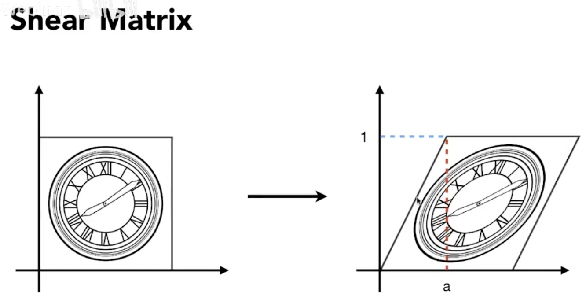
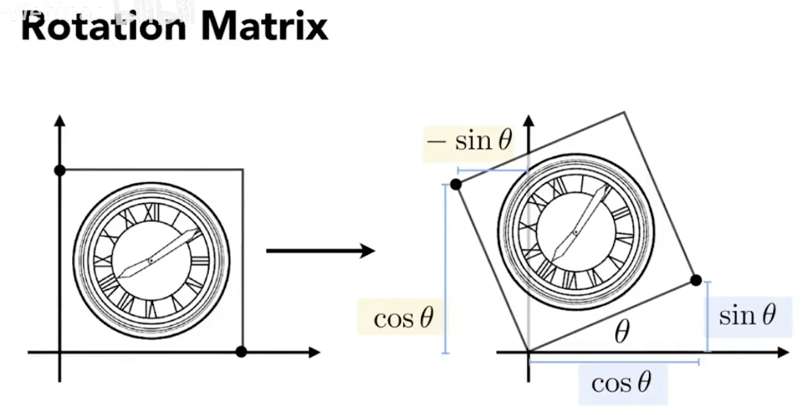
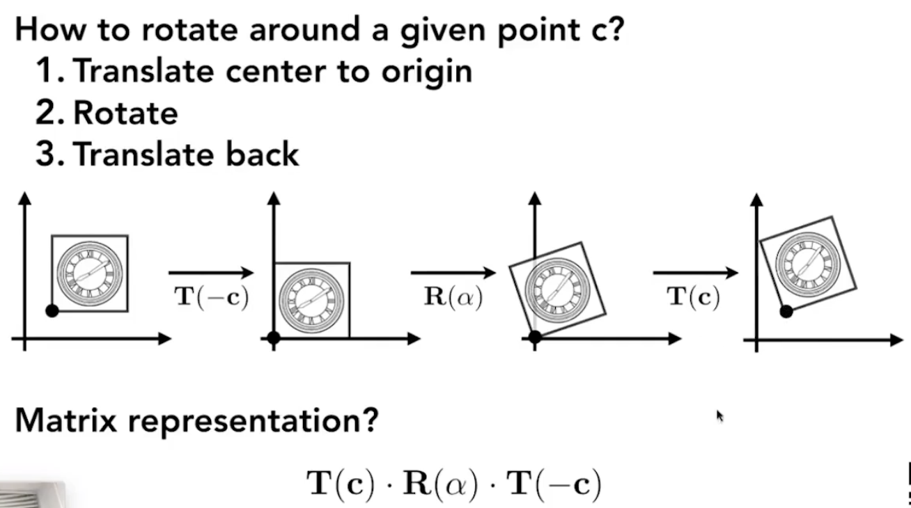

# Lecture 03 Transformation in 2D

## Why transformer
- 视角位置变换
- 物体位置变换
- 物体形体变换
- 3D to 2D的投影
  
## 2D Transformer
1. Scale Transformer 缩放变换
   - x' = sx
   - y' = sy
   - 用缩放矩阵
$$
\begin{bmatrix}
x' \\ 
y' 
\end{bmatrix}
=
\begin{bmatrix}
sx & 0 \\
0 & sy
\end{bmatrix}
\begin{bmatrix}
x \\
y
\end{bmatrix}
$$

2. Reflection Metrix 翻转变换

$$
\begin{bmatrix}
x' \\ 
y' 
\end{bmatrix}
=
\begin{bmatrix}
-1 & 0 \\
0 & 1
\end{bmatrix}
\begin{bmatrix}
x \\
y
\end{bmatrix}
$$

3. Shear Matrix 切变(斜拉)
   - Hints:
     - Horizontal shift is 0 at y=0
     - Horizontal shift is a at y=1
     - Vertical shift is always 0
   - Matrix form:

$$
\begin{bmatrix}
x' \\ 
y' 
\end{bmatrix}
=
\begin{bmatrix}
1 & a \\
0 & 1
\end{bmatrix}
\begin{bmatrix}
x \\
y
\end{bmatrix}
$$

4. Rotate 旋转 (about (0,0), CCW by default(逆时针))

$$
\begin{bmatrix}
x' \\ 
y' 
\end{bmatrix}
=
\begin{bmatrix}
cos\theta & -sin\theta \\
sin\theta & cos\theta
\end{bmatrix}
\begin{bmatrix}
x \\
y
\end{bmatrix}
$$
- 旋转变换的特殊性质
$$
R_\theta
=
\begin{bmatrix}
cos\theta & -sin\theta \\
sin\theta & cos\theta
\end{bmatrix}
$$
$$
R_{-\theta}
=
\begin{bmatrix}
cos\theta & sin\theta \\
-sin\theta & cos\theta
\end{bmatrix}
$$
$$
R_{-\theta}=R_\theta^T=R_\theta^{-1}
$$

### 综上，所有线性二维变换都可以写成矩阵形式

$$
\begin{bmatrix}
x' \\ 
y' 
\end{bmatrix}
=
\begin{bmatrix}
a & b \\
c & d
\end{bmatrix}
\begin{bmatrix}
x \\
y
\end{bmatrix}
$$

## Homogeneous Coordinates 齐次坐标
1. Translation 平移
   - Translation cannot be represented in matrix form
   - is not linear transform
   - 故考虑引入齐次坐标
$$
\begin{bmatrix}
x' \\ 
y' 
\end{bmatrix}
=
\begin{bmatrix}
a & b \\
c & d
\end{bmatrix}
\begin{bmatrix}
x \\
y
\end{bmatrix}
+
\begin{bmatrix}
tx \\
ty
\end{bmatrix}
$$

2. Add a third coordinate (w-coordinate) 
   - 2D point = $(x, y, 1)^T$
   - 2D vector = $(x, y, 0)^T$
  
3. Matrix representation of translations

$$
\begin{bmatrix}
x' \\ 
y' \\
w' 
\end{bmatrix}
=
\begin{bmatrix}
1 & 0 & t_x \\
0 & 1 & t_y \\
0 & 0 & 1
\end{bmatrix}
\begin{bmatrix}
x \\
y \\
1
\end{bmatrix}
=
\begin{bmatrix}
x + t_x \\
y + t_y \\
1
\end{bmatrix}
$$

4. w-coordinate: Valid operation if w-coordinate of result is 1 or 0
    - vector + vector = vector
    - point - point = vector
    - point + vector = point
    - point + point = 这两个点的中点

$$
\begin{bmatrix}
x \\
y\\
w
\end{bmatrix}
is\space
the\space
2D\space
point\space
\begin{bmatrix}
x/w \\
y/w \\
1
\end{bmatrix}
,\space
w≠0
$$

### 以上变换统称为仿射变换 Affine Transformations = Linear + translation
- scale
$$
S(s_x,s_y)=
\begin{bmatrix}
    s_x & 0 & 0 \\
    0 & s_y & 0 \\
    0 & 0 & 1
\end{bmatrix}
$$
- Rotation
$$
R(\alpha)=
\begin{bmatrix}
    cos\alpha&-sin\alpha&0\\
    sin\alpha&cos\alpha&0\\
    0&0&1
\end{bmatrix}
$$
- Translation
$$
T(t_x,t_y)=
\begin{bmatrix}
    1&0&t_x\\
    0&1&t_y\\
    0&0&1
\end{bmatrix}
$$

## 其他2D变换
1. Inverse Transformer 逆变换
- $M^{-1}$ is the inverse of transformer $M$

2. Composing Transformer 变换组合
- 做矩阵乘法
- 不满足交换律 Transformer ordering matters
- sequence of affine transforms $A_1,A_2,A_3...$
- Composed by matrix multiplication $A_n*A_{n-1}*...*A_2*A_1*
\begin{bmatrix}
x\\
y\\
1
\end{bmatrix}
$
and obtain a single matrix representing combined transform

3. Decomposing complex transforms 变换分解
