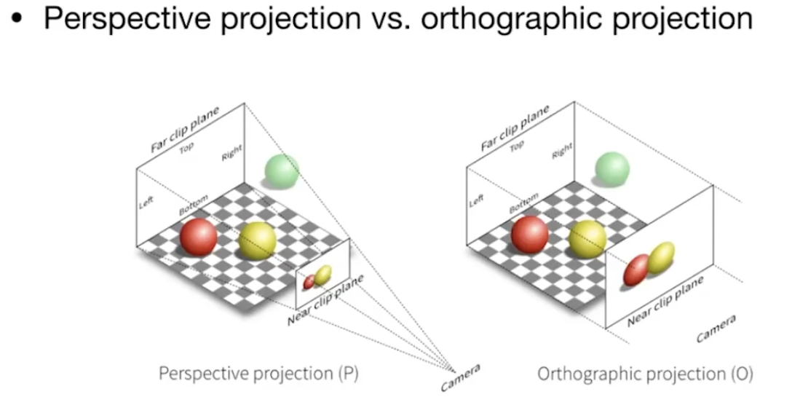
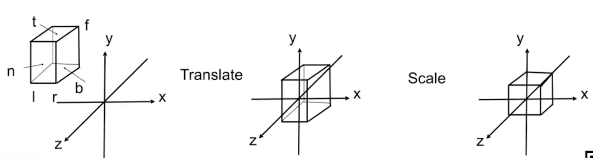
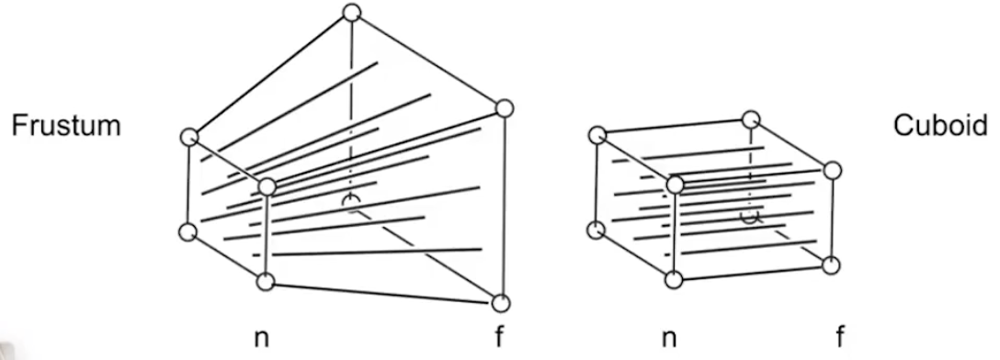
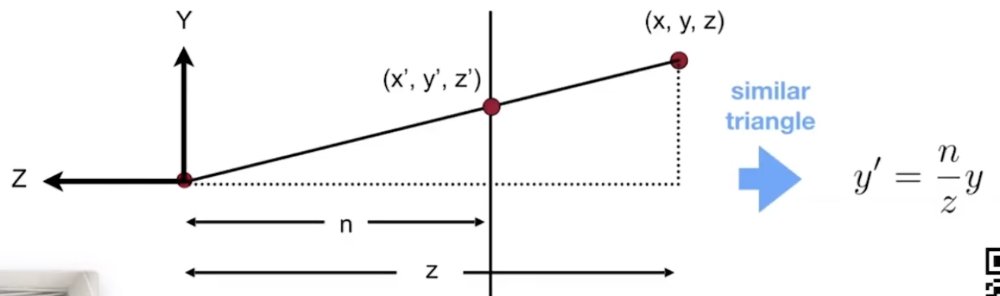
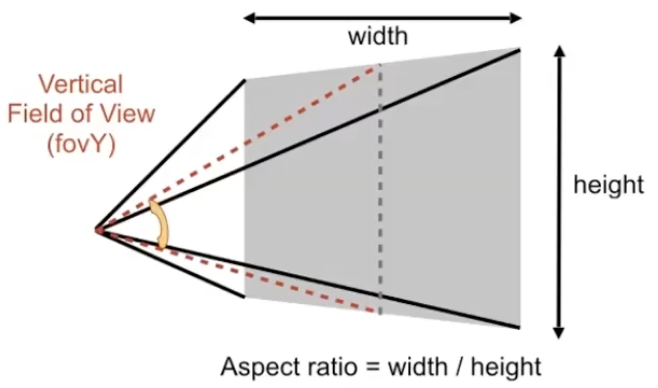
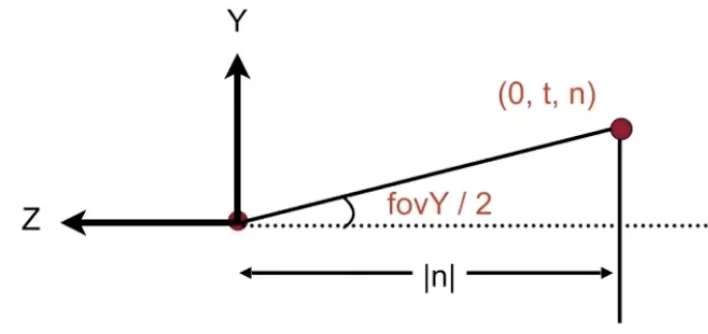

# Lecture 04 Transformation in 3D and Viewing Transformation

## Homogeneous coordinates in 3D
- 3D point = $(x,y,z,1)^T$
- 3D vector = $(x,y,z,0)^T$
- $(x,y,z,w)^T$(w≠0) is the 3D point: $(x/w,y/w,z/w)^T$

## 3D Transformations
1. Use 4x4 matrix for affine transformations
    $$
    \begin{bmatrix}
        x'\\
        y'\\
        z'\\
        1
    \end{bmatrix}
    =
    \begin{bmatrix}
        a&b&c&t_x\\
        d&e&f&t_y\\
        g&h&i&t_z\\
        0&0&0&1
    \end{bmatrix}
    •
    \begin{bmatrix}
        x\\
        y\\
        z\\
        1
    \end{bmatrix}
    $$
    - Note: Linear transform first, then translation
2. 3D rotation
   - rotation around x-axis
   $$
   R_x(\alpha)=
   \begin{bmatrix}
       1&0&0&0\\
       0&cos\alpha&-sin\alpha&0\\
       0&sin\alpha&cos\alpha&0\\
       0&0&0&1
   \end{bmatrix}
   $$
   - rotation around y-axis (note: differant from x and z)
   $$
   R_y(\alpha)=
   \begin{bmatrix}
       cos\alpha&0&sin\alpha&0\\
       0&1&0&0\\
       -sin\alpha&0&cos\alpha&0\\
       0&0&0&1
   \end{bmatrix}
   $$
   - rotation around z-axis
   $$
   R_z(\alpha)=
   \begin{bmatrix}
       cos\alpha&-sin\alpha&0&0\\
       sin\alpha&cos\alpha&0&0\\
       0&0&1&0\\
       0&0&0&1
   \end{bmatrix}
   $$
   - Compose any 3D rotation from $R_x$,$R_y$,$R_z$
   $$
   R_{xyz}(\alpha,\beta,\gamma) = 
   R_x(\alpha)R_y(\beta)R_z(\gamma)
   $$
   
                                So-called Euler angles, often used in flight simulators: roll, pitch, yaw
   
   - rotation by angle $\alpha$ around axis n (bypass (0,0,0) ) :
    $$
    R(\mathbf{n},\alpha)=cos(\alpha)\mathbf{I}+(1-cos\alpha)\mathbf{n}\mathbf{n}^T+sin\alpha
    \begin{bmatrix}
        0&-n_z&n_y\\
        n_z&0&-n_x\\
        -n_y&n_x&0
    \end{bmatrix}
    $$
  
3. others similar to 2D

## Viewing transformation

### View/Camera Transformation

1. what is view transformation?
   - how to take a photo
   - Find a good place and arrange people (model transformation)
   - Find a good "angle" to put the camera (view transformation)
   - Cheese! (projection transformation)
   - short as MVP transformation

2. define the camera
   - Position $\vec{e}$
   - Look-at / gaze direction $\vec{g}$
   - Up direction $\vec{t}$

3. Key observation
   - If the camera and all objects move together, the "photo" will be the same
   - ALWAYS transform the camera to the origin, up at Y, lokk at -Z
   - and transform the objects along with the camera
   - how to transform? $M_{view}$
$$
M_{view}=R_{view}T_{view}
\\
T_{view}=
\begin{bmatrix}
    1&0&0&-x_e\\
    0&1&0&-y_e\\
    0&0&1&-z_e\\
    0&0&0&1
\end{bmatrix}
\\
Rotate\space g\space to\space -Z,\space t\space to\space Y, (g\times t)\space to\space X
- Consider\space its\space inverse\space rotation:\\
X\space to\space (g\space x\space t)\space,\space Y\space to\space t, Z\space to\space -g\\
R_{view}^{-1}=
\begin{bmatrix}
    x_{\bm{g}\times\bm{t}}&x_t&x_{-g}&0\\
    y_{\bm{g}\times\bm{t}}&y_t&y_{-g}&0\\ 
    z_{\bm{g}\times\bm{t}}&z_t&z_{-g}&0\\
    0&0&0&1
\end{bmatrix}\\
so\space R_{view}=
\begin{bmatrix}
    x_{\bm{g}\times\bm{t}}& y_{\bm{g}\times\bm{t}}&z_{\bm{g}\times\bm{t}}&0\\
    x_t&y_t&z_t&0\\
    x_{-g}&y_{-g}&z_{-g}&0\\
    0&0&0&1
\end{bmatrix}\space (旋转矩阵是正交矩阵)\\
and\space get\space M_{view}
$$

### Projection Transformation 投影变换
- Orthographic projection 正交投影 
- Perspective projection 透视投影，近大远小

#### Orthographic projection
   1. 理解原理
   - Camera located at standard position
   - DROP Z Coordinate
   - Translate and scale the rectangle to $[-1,1]^2$
  
   2. 标准做法
   - We want to map a cuboid $[l, r] \times [b, t] \times [f, n]$ to the "canonical (正则、规范、标准)" cube $[-1,1]^3$
   
   - first translate to center, then scale into canonical cube
   - Transformation matrix
   $$
   M_{ortho}=
   \begin{bmatrix}
    \frac{2}{r-l}&0&0&0\\
    0&\frac{2}{t-b}&0&0\\
    0&0&\frac{2}{n-f}&0\\
    0&0&0&1
   \end{bmatrix}•
   \begin{bmatrix}
    1&0&0&-\frac{r+l}{2}\\
    0&1&0&-\frac{t+b}{2}\\
    0&0&1&-\frac{n+f}{2}\\
    0&0&0&1
   \end{bmatrix}
   $$
   - note: the right hand coords caused that $z_{near}$ > $z_{far}$, which is intuitive. That's why OpenGL uses left hand coords.

#### Perspective Projection
  - Most common in Computer Graphics, art, visual system
  - Further objects are smaller
  - Parallel lines not parallel; converge to single point
1. how to do perspective projection
   - First "squish" the frustum into a cuboid (n -> n, f-> f) ($M_{persp}$->$_{ortho}$) (n平面不变，f平面只放缩)
   - Then do orthographic projection ($M_{ortho}$, already known!)
    

2. how to do squish
   
   - $$y'=\frac{n}{z}y\space\space x'=\frac{n}{z}x$$
   - in homogeneous coordinates,
   $$
   \begin{bmatrix}
    x\\
    y\\
    z\\
    1\\
   \end{bmatrix}->
   \begin{bmatrix}
    \frac{n}{z}x\\
    \frac{n}{z}y\\
    unknown\\
    1
   \end{bmatrix}=
   \begin{bmatrix}
    nx\\
    ny\\
    still unknown\\
    z
   \end{bmatrix}
   $$
   - So the squish does:
    $$
    M_{persp->ortho}^{(4\times4)}•
    \begin{bmatrix}
        x\\y\\z\\1
    \end{bmatrix}=
    \begin{bmatrix}
        nx\\ny\\unknown\\z
    \end{bmatrix}
    $$
    - and so we can figure out part of M:
    $$
    M_{persp->ortho}^{(4\times4)}=
    \begin{bmatrix}
        n&0&0&0\\
        0&n&0&0\\
        ?&?&?&?\\
        0&0&1&0
    \end{bmatrix}
    $$
    - Also, for the third row, it does not change the z-axis
    - suggest it's (0 0 A B) (z has nothing to do with x and y)
    $$An+B=n^2 \space \space Af+B=f^2\\A=n+f\space\space B=-nf$$
    - and we know $M_{persp->ortho}^{(4\times4)}$
    
3. 定义视锥的另一种方式(从视线出发)
   - vertical field_of_view 垂直视角 (fovY)
   - aspect ratio 长宽比
   - near and far
   - (垂直视角和长宽比可推出水平视角)
    
4. how to convert from fovY and aspect to l,r,b,t?
   - $$\tan\frac{fovY}{2}=\frac{t}{\left|n\right|}$$
   - $$aspect=\frac{r}{t}$$
    

