# Lecture 06 Antialiasing and Visibility/Occlusion

## Antialiasing 反锯齿

### Sampling theory

1. Sampling Artifacts in Computer Graphics
   - Jaggies 锯齿/走样
   - Moire Patterns in Imaging 摩尔纹
   - Wagon Wheel Illusion (False Motion) (in time sampling)
   - many more...
   - In essence, they are caused by: Signals are changing too fast but sampled too slowly

2. Antialiasing Idea: Blurring(pre-filtering) before Sampling 先模糊/滤波
   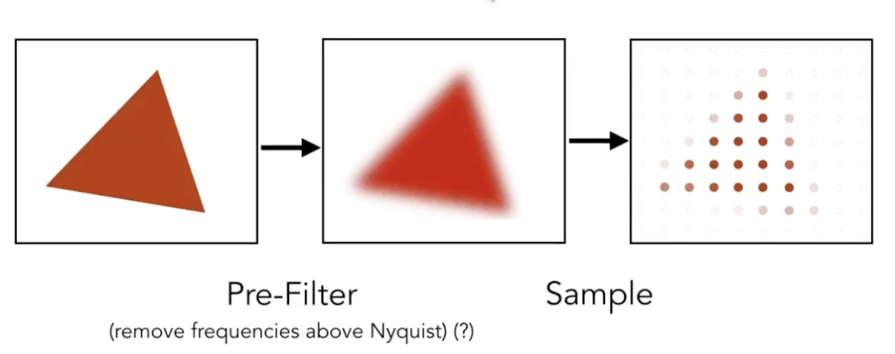
   - must first blur but not later - why?

3. Frequency Domain 频域
   - $f=\frac{1}{T}$
   - Fourier Transformer 傅立叶变换(展开) 即将一个函数转化为不同频率的函数之和
     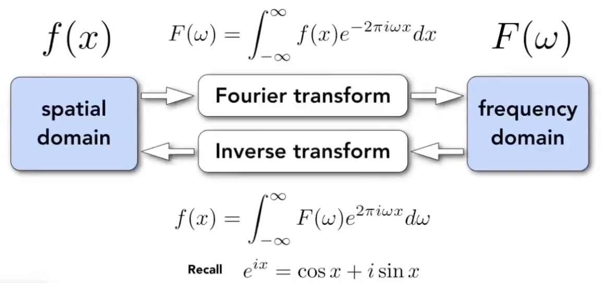
   - Higher Frequencies Need Faster Sampling
   - 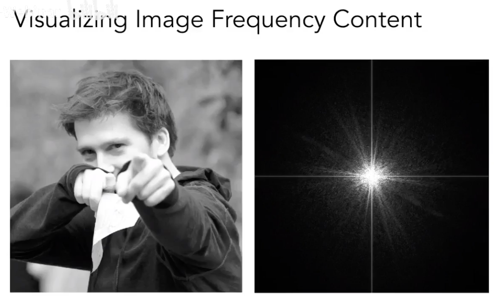
   - 高通滤波(留下边界)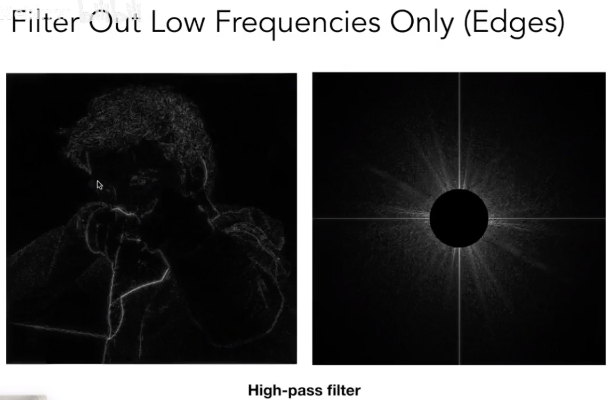
   - 低通滤波(模糊边界)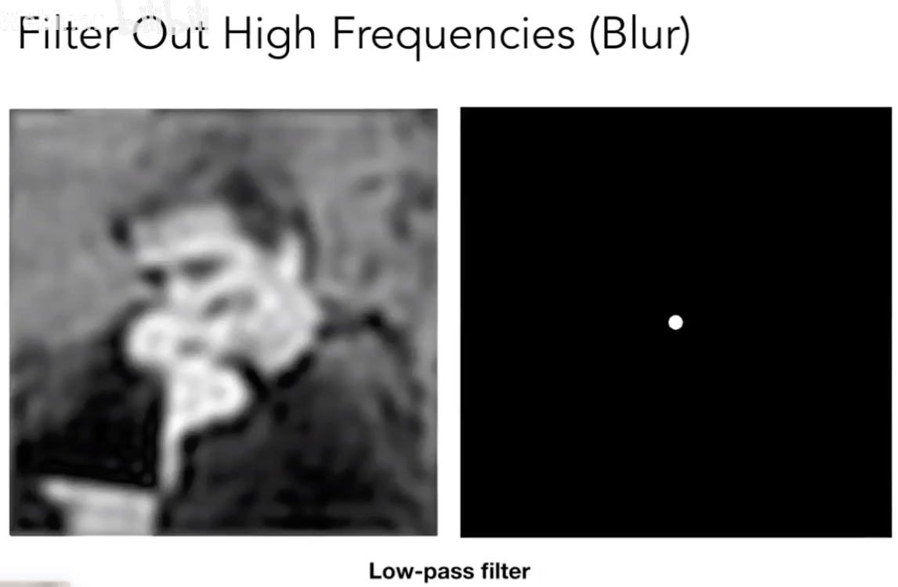
   - 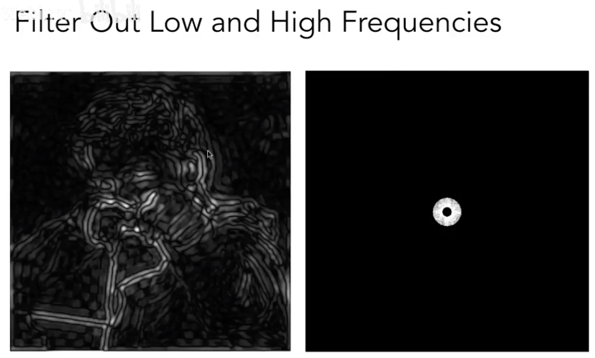

### Two options for filtering
1. Filtering = Getting Rid of Certain Frequency contents
- How to do it:
  - Transform to frequency domain (Fourier transform)
  - Multiply by Fourier transform of convolution kernel
  - Transform back to spatial domain (inverse Fourier)

2. Filtering = Convolution 卷积
- How to do it:
  - define a concolution kernel ( like 
$\frac{1}{9}\begin{bmatrix}
    1&1&1\\
    1&1&1\\
    1&1&1
  \end{bmatrix}
$)
  - for every single 3x3 block in the image, do dot product to get a new value for the center of the block, thus getting a blurred image
- Box Function = 'Low Pass' Filter
- Wider Filter Kernel = Lower Frequencies

3. Convolution in the spatial domain is equal to multiplication in the frequency domain, and vice versa:
   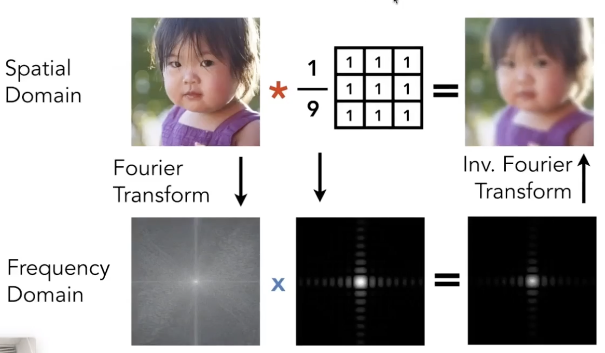

### Why aliasing?
1. Sampling = Reqeating Trequency Contents
   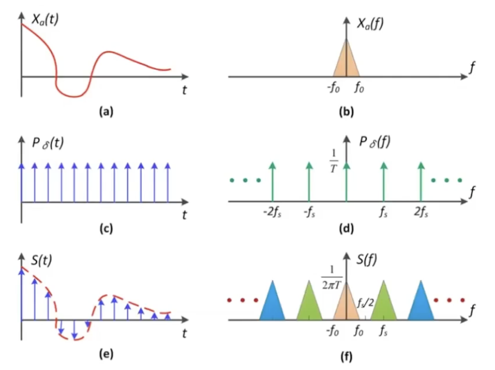

2. Aliasing = Mixed Frequency Contents
   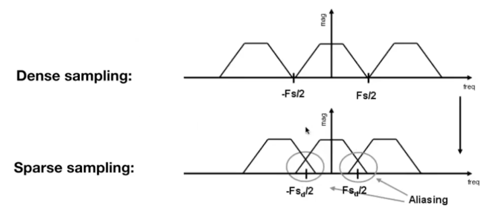

### How to Reduce Aliasing
1. Option 1: Increase sampling rate
   - Essentially increasing the distance between replicas in the Fourier domain
   - Higher resolution displays, sensors, framebuffers...
   - But, costly & may need very high resolution

2. Option 2: Antialiasing
   - Making Fourier contents "narrower" before repeating
   - i.e. Filtering out high frequencies before sampling
   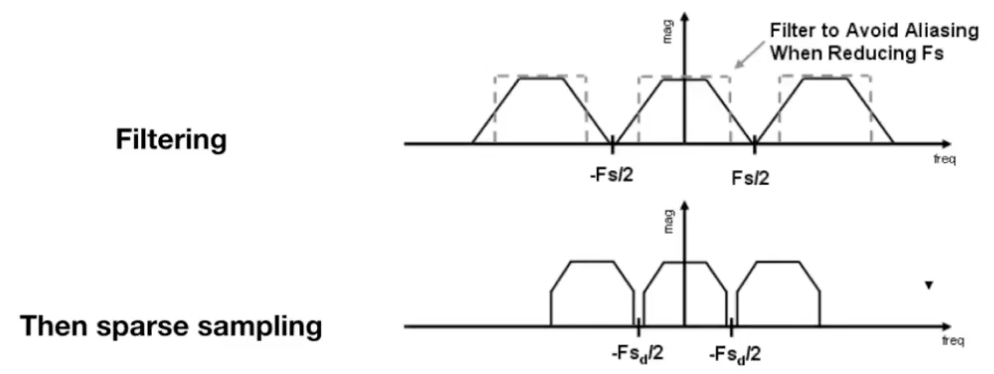
   - i.e. Filtering: using a 1 pixel-width box filter to compute average pixel value
   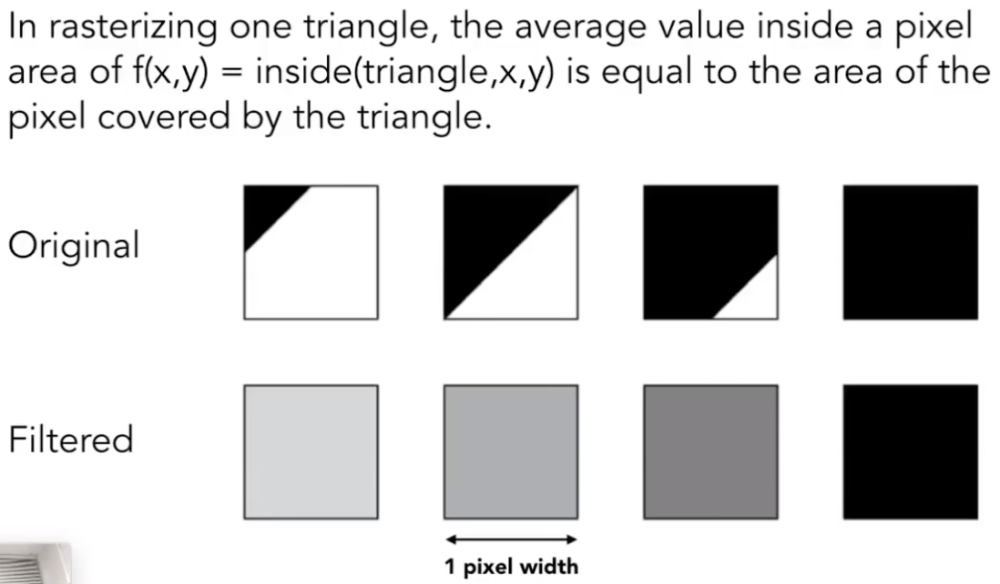

3. option 3: Antialiasing By Supersampling (MSAA) 近似反走样的“模糊”步骤
   - Supersampling: Approximate the effect of the 1-pixel box filter by sampling multiple locations within a pixel and averaging their values: 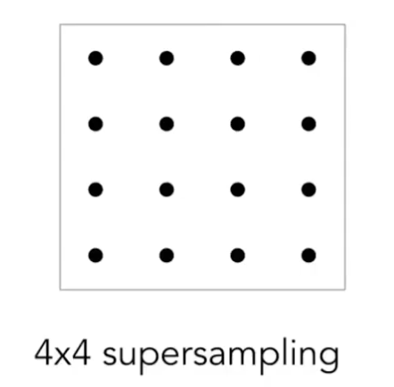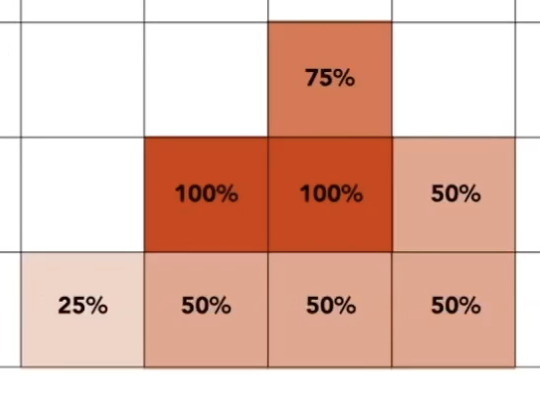
   - What's the cost of MSAA? more sampling points

4. option 4: FXAA (Fast Approximate AA) 图像处理

5. option 5: TAA (Temporal AA) 复用上一帧的处理
   
6. option 6: Super resolution / super sampling 超分辨率
   - From low resolution to high resolution
   - Essentially still "not enough samples" problem
   - DLSS (Deep Learning Super Sampling)