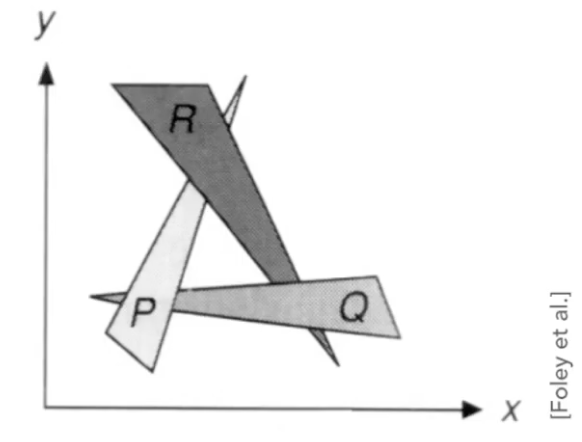
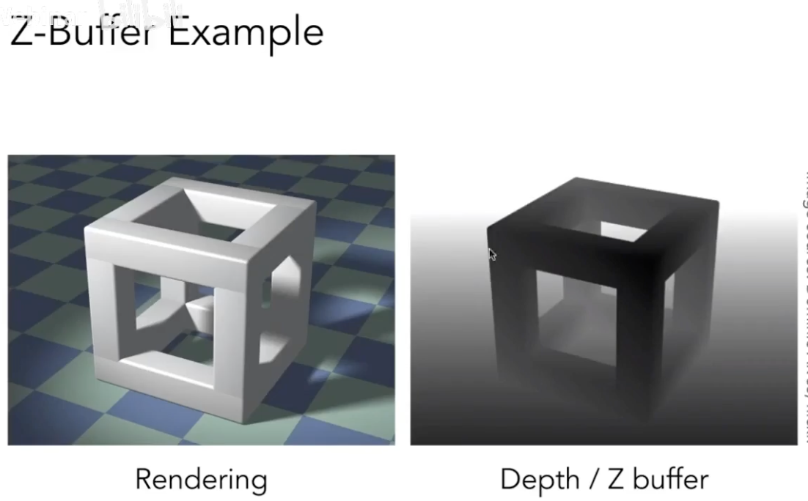
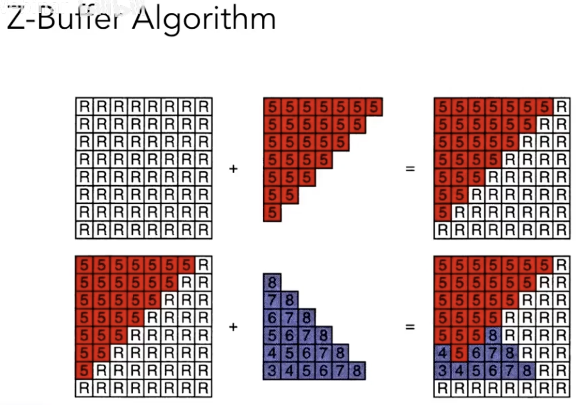
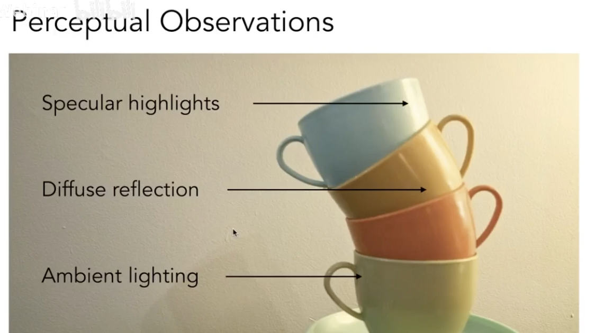
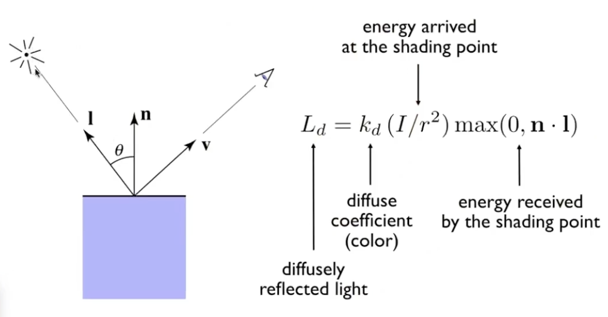
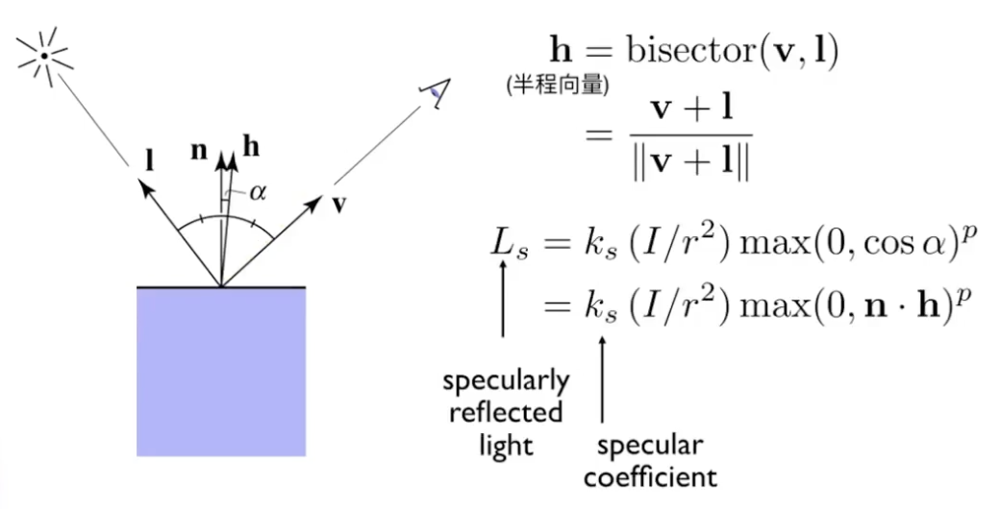
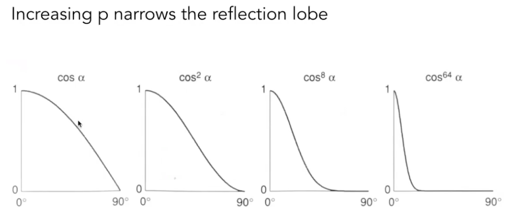
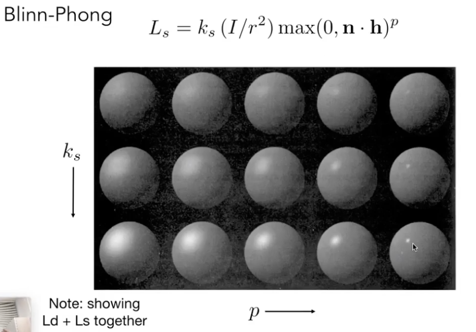
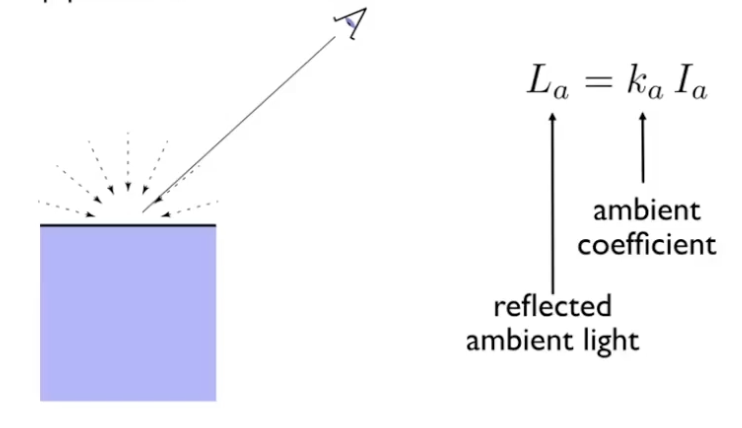
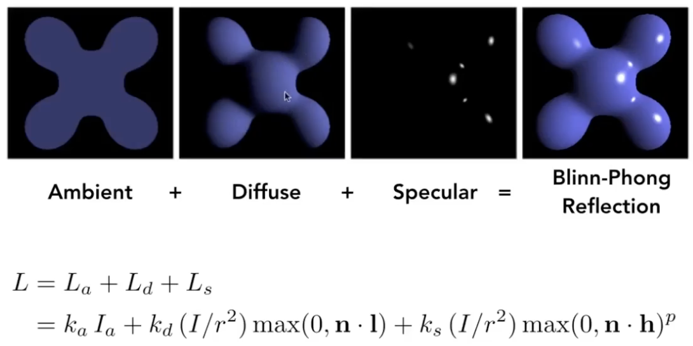

# Lecture 07 Shading 1 

## Visibility / Occlusion

### Painter's algorithm 画家算法
1. Paint from back to front, overwrite in the framebuffer 覆盖
2. Requires sorting in depth (O(nlogn) for n triangles)
3. Can have unresolvable depth order
   

### Z-Buffer 深度缓存算法 
1. the algorithm that eventually won
2. Store current min. z-value for each sample(pixel)
3. Needs an additional buffer for depth values
   - frame buffer stores color values
   - depth buffer (z-buffer) stores depth
4. IMPORTANT: For simplicity we suppose z is always positive (smaller z -> closer, larger z -> further)
   
5. pseudo-code
    ```python
    for T in triangles:
        for each sample (x, y, z) in T:
            if z < zbuffer[x][y]:
                framebuffer[x][y]=rgb[sample]
                zbuffer[x][y]=z
            else:
                do nothing

6. Complexity: O(n) for n triangles (assuming constant coverage)
7. The orders of triangles don't matter
8. Most important visibility algorithm -- Implemented in hardware for all GPUs


## Shading 着色: The process of applying a material to an object 应用材质

### A Simple Shading Model (Blinn-Phong Reflectance Model)
   

1. Shading is local -- Compute light reflected toward camera at a specific shading point
2. Inputs: 
   - Viewer direction, $\vec{v}$
   - Surface normal, $\vec{n}$  法向量
   - Light direction, $\vec{l}$ (for each of many lights)
   - Surface parameters (color, shininess, ...)
3. No shadows will be generated
4. Diffuse Reflection 漫反射
   - Light is scattered uniformly in all directions
   - how much light(energy) is received?
   - Lambert's cosine law: light per unit area is proportional to ( $cos\theta=\vec{l}\space•\space\vec{n}$ )
   - Lambertian(Diffuse) shading: Shading independent of view direction
   - 
   - k_d = 1: 无吸收, 全反射; k_d = 0: 无反射, 全吸收
   - different color: define different k_d for r,g,b color
5. Specular Reflection 镜面反射
   - Intensity depends on view direction
   - Bright near mirror reflection direction
   - "V close to mirror direction" is equal to "half vector near normal"
   - Measure "near" by dot product of unit vectors
   
   
   - normally, p>=100
   

6. Anbient Term 环境光照
   - Shading that does not depend on anything
   - Add CONSTANT color to account for disregarded illumination and fill in balck shadows
   - this is approximate
   
   