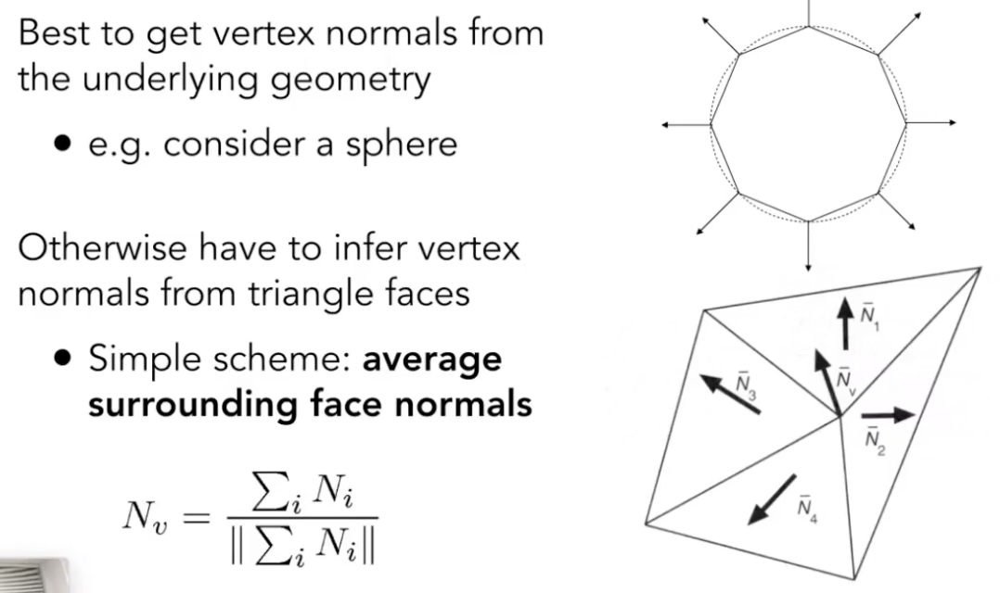
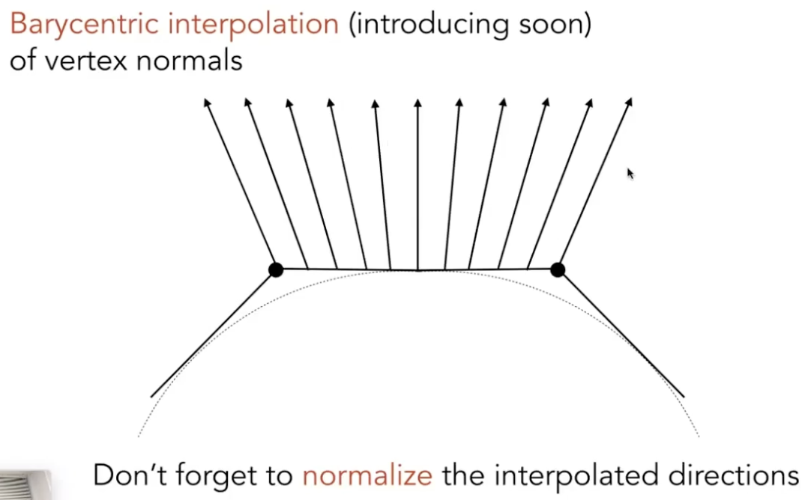
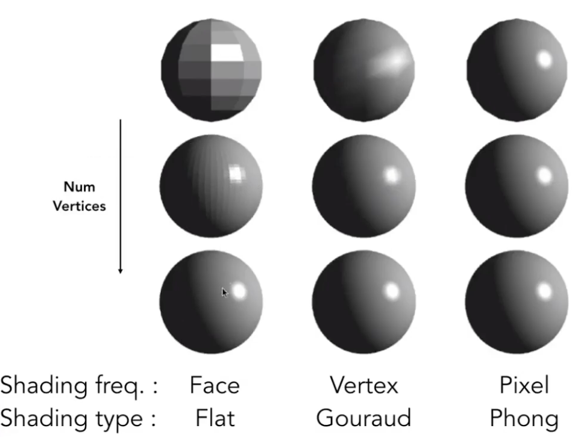
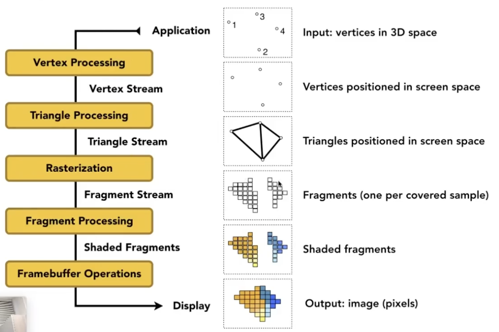
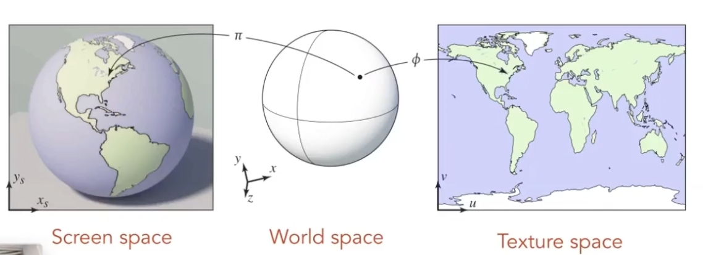
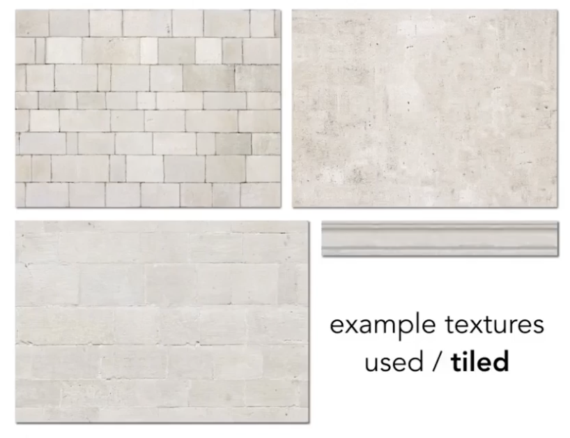

# Lecture 08 Shading 2

## Shading Frequency

1. Flat shading
   - Shade each triangle
   - Triangle face is flat -- one normal vector
   - not good for smooth surfaces

2. Gouraud shading
   - Shade each vertex 顶点
   - Interpolate colors from vertices across triangle 
   - each vertex has a normal vector
   - Defining per-vertex normal vectors
    
   - Defining per-pixel normal vectors
   

3. Phong shading
   - Shade each pixel
   - Interpolate normal vectors across each triangle
   - Compute full shading model at each pixel
   - not the Blinn-Phong Reflectance Model

## Graphics (Real-time Rendering) Pipeline

### Shader Programs
1. Program vertex and fragment processing stages
2. Describe operation on a single vertex (or fragment)
3. Goal: Highly Complex 3D Scenes in Realtime
4. GPU: Heterogeneous, Multi-Core Procesor

## Texture Mapping 纹理映射

### Surfaces are 2D
1. Surfaces lives in 3D world space
2. Every 3D surface point also has a place where it goes in the 2D image (texture) 把物体表面的纹理(漫反射系数)铺开到平面上
   

3. Visualization of Texture Coordinates -- each triangle vertex is assigned a texture coordinate (u,v) (0≤u,v≤1)
4. Texture can be used multiple times
   