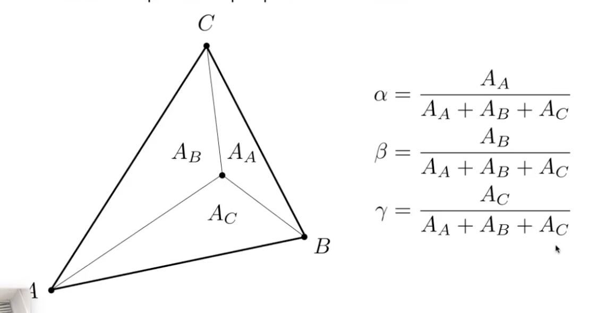
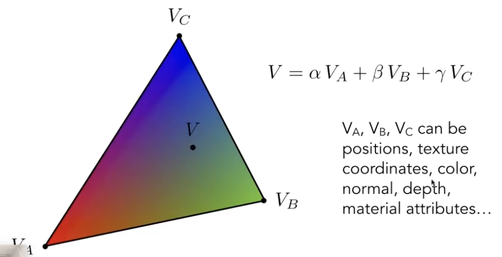
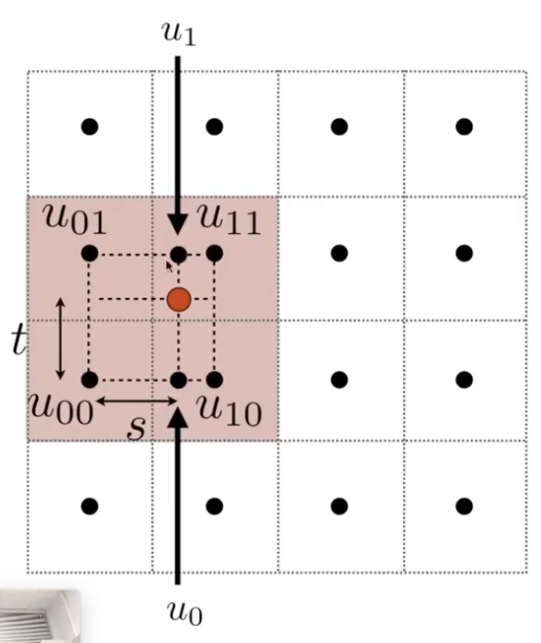
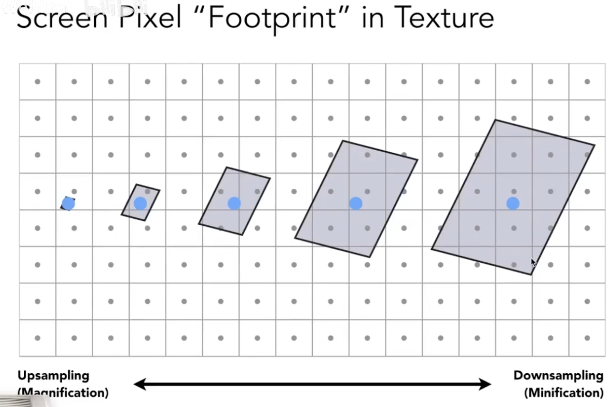
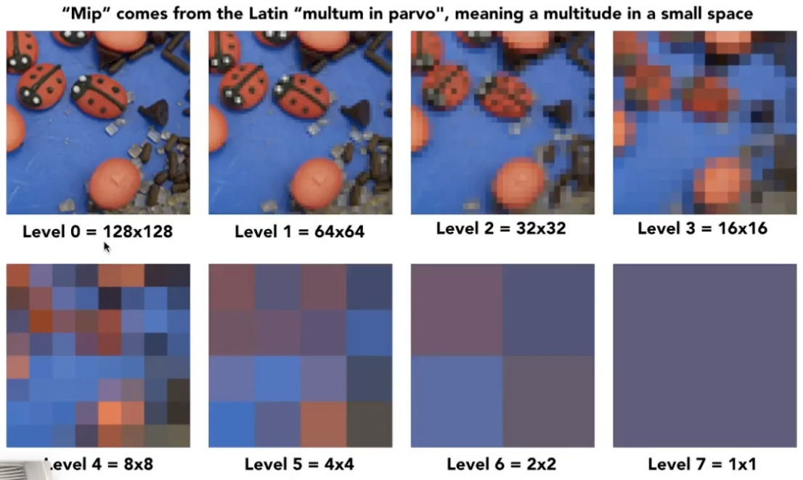
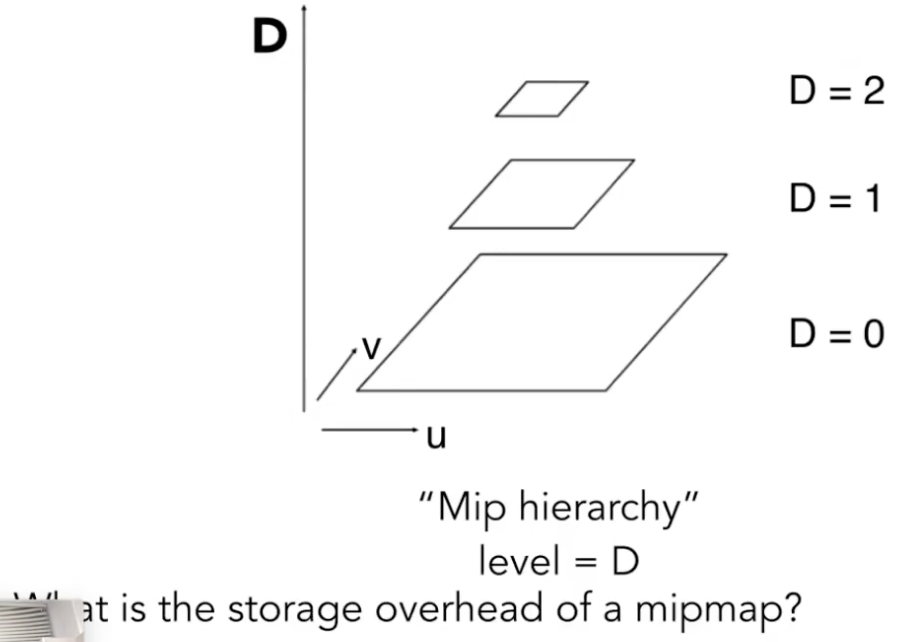
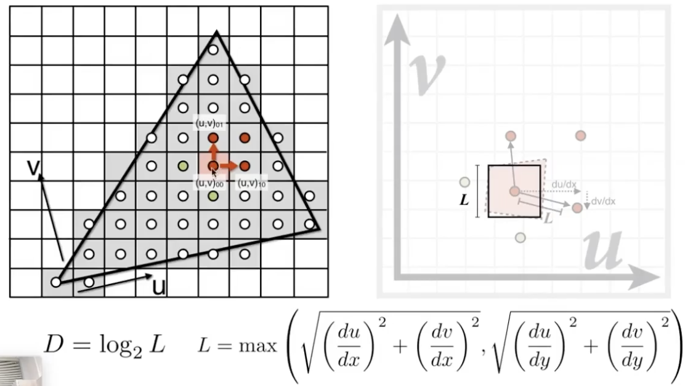
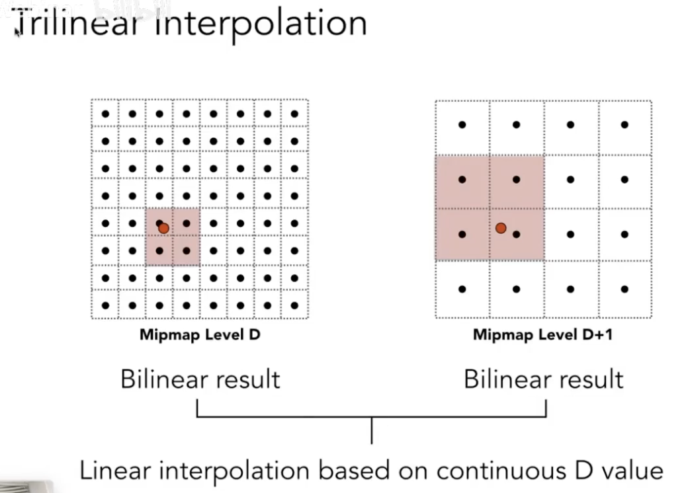
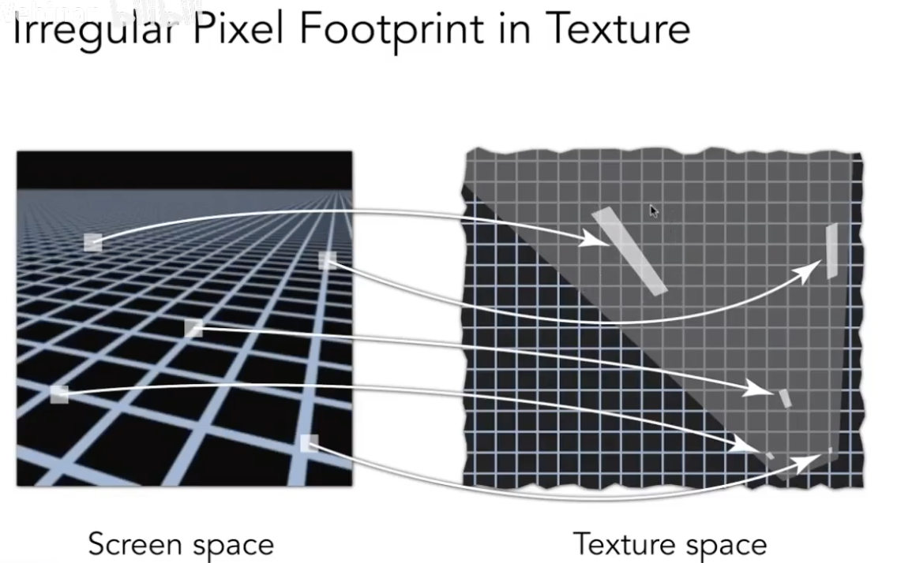
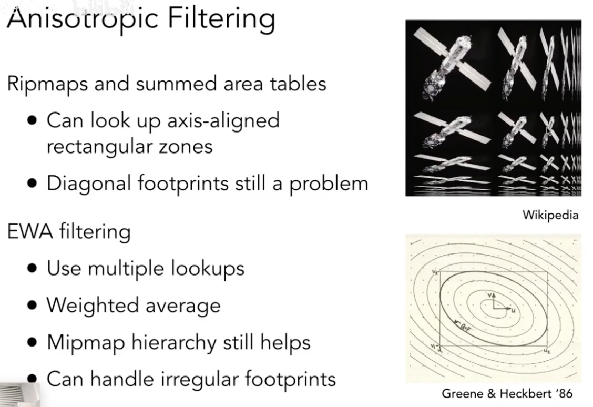

# Lecture 09 Shading 3

## Barycentric coordinates 重心坐标: Interpolation across triangles 三角形内插值

1. goal: With specified values at vertices, obtain smoothly varying values across triangles
2. what to interpolate: texture coordinates, colors, normal vectors, ...
3. Barycentric Coordinates:
   - A coordinate system for triangles $(\alpha,\beta,\gamma)$
   - for each (x,y), $(x,y)=\alpha A+\beta B+\gamma C$ and $\alpha+\beta+\gamma=1$
   - $(\alpha,\beta,\gamma)$ is the barycentric coorinates for $(x,y)$
   - Inside the triangle if all three coordinates are non-negative
   - Geomatric viewpoint -- proportional areas: 
   
   - The barycentric coordinate of centroid(重心) is $(\frac{1}{3},\frac{1}{3},\frac{1}{3})$

4. Using Barycentric Coordinates to Linearly interpolate values at vertices
   
   - note: barycentric coordinates are not invariant under projection 即投影后重心坐标会改变，因此应在投影之前（3维空间中）进行插值

## Texture Magnification 问题：纹理放大

### What if the texture is too small? (Upsampling)
- Generally don't want this — insufficient texture resolution
- A pixel on a texture—a texel（纹理元素、纹素）

1. Bilinear interpolation
   - Want to sample texture value f(x,y) at red point
   - Black points indicate texture sample locations
   - We take 4 nearest sample locations, with texture values as labeled, and fractional offsets, as $(s,t)$
    
   - Linear interpolation (1D): 
    $$lerp(x, v_0, v_1) = v_0+ x(v_1 - v_0)$$
   - Two helper lerps: 
    $$u_0=lerp(s,u_{00},u_{10})$$
    $$u_1=lerp(s,u_{01},u_{11})$$
   - Final vertical lerp, to get result:
    $$f(x,y)=lerp(t,u_0,u_1)$$

2. Bicubic interpolation
   - Instead of using 4 nearest samples, use 16 nearest samples

### What if the texture is too large? (Downsampling)
- may lead to aliase 走样

1. Will supersampling work?
   - Yes, high quality, but costly
   - When highly minified, many texels in pixel footprint
   - Signal frequency too large in a pixel
   - Need even higher sampling frequency

2. Do not sample, use the average value
   - Point Query vs. (Avg.)Range Query
   - Different Pixels -> Different-Sized Footprints
   - Mipmap: Allowing(fast, approxmate, square) range queries 近似的、正方形的范围查询
     - 
     -  
     - Computing Mipmap Level D:
       
     - then, fetch the corresponding ave value in level D: (三线性插值)
       
   - Mipmap Liminations: Overblur

3. Anisotropic Filtering 各项异性过滤: 比Mipmap三线性插值好
   - using ripmaps and summed area tables
   - Can look up axis-aligned rectangular zones
    
   - Diagonal footprints still a problem
   

4. EWA Filtering
   - Use multiple lookups
   - Weighted average
   - Mipmap hierarchy still helps
   - Can handle irregular footprints
   - high costs