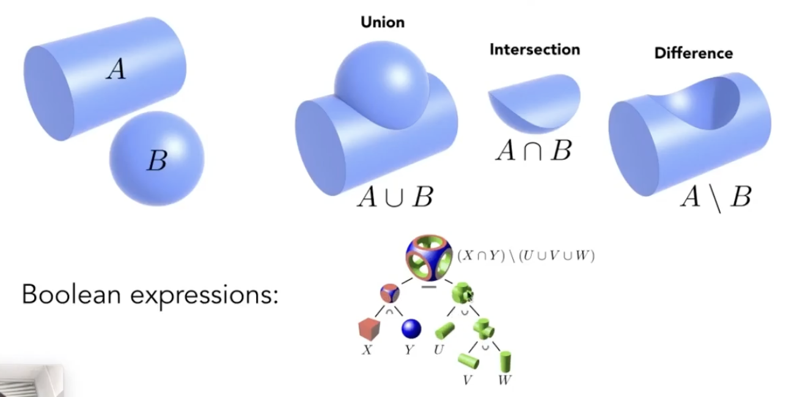

# Lecture 10 Geometry 1

## Many Ways to Represent Geometry

1. Implicit Representations of Geometry 隐式表示
   - Based on classifying points -- points satisfied relationship
   - e.g. sphere: all points in 3D, where $x^2+y^2+z^2=1$
   - more generally, $f(x,y,z)=0$
   - Sampling can be hard
   - Inside/Outside tests easy, just plug a point in $f(x,y,z)$

2. Explicit Representations of Geometry 显式表示
   - All points are given directly or via parameter mapping
    
   - e.g. $f(u,v)=( (2+cosu)cosv,(2+cosu)sinv,sinu )$ 参数映射
   - Inside/Outside tests hard

Best representation depends on the task!

3. Constructive Solid Geometry (Implicit) CSG隐式表示法
   - Combine implicit geometry via Boolean operations
    

4. Distance Functions (Implicit)
   - giving minimum distance (could be signed distance)from anywhere to object
   - an example: Blending a moving boundary
    
    SDF -- signed distance function 有符号距离函数
    
   - Level Set Methods (Implicit)
     - Closed-form equations are hard to describe complex shapes
     - Alternative: store a grid of values approximating function
        
     - Can be used in 3D to find out surfaces

5. Fractals 分形 (Implicit)
   - Exhibit self-similarity, detail at all scales
   - Hard to control shape