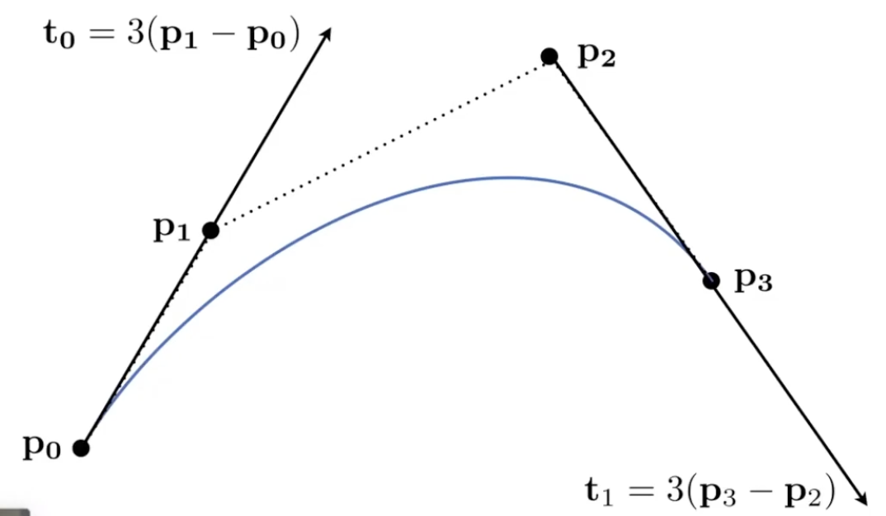
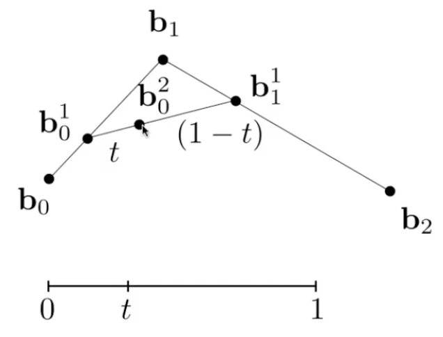
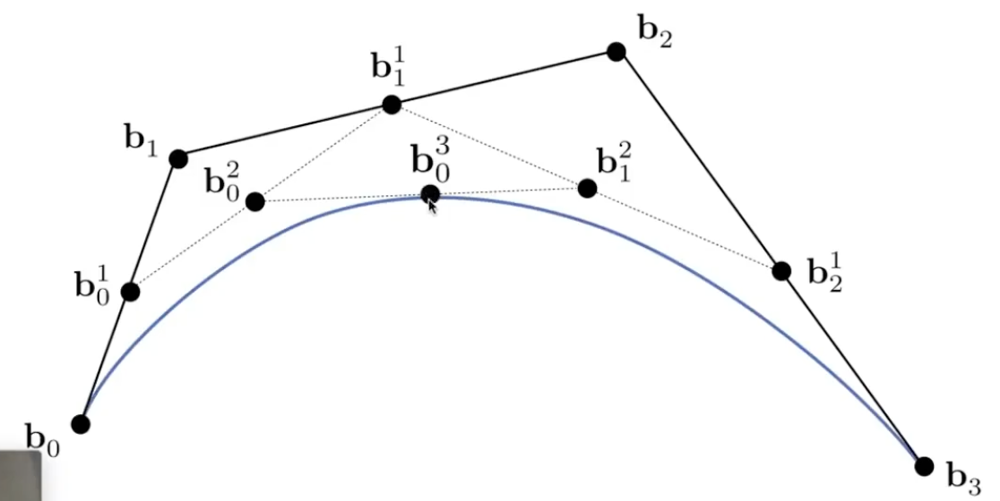
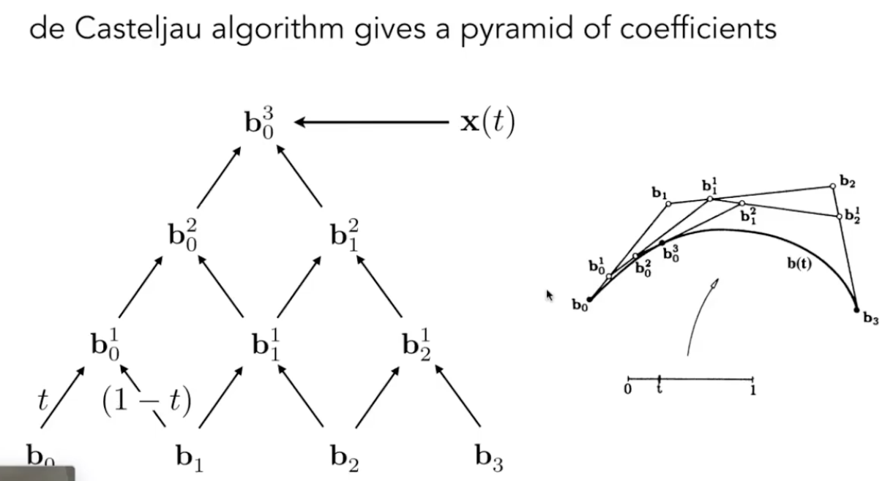
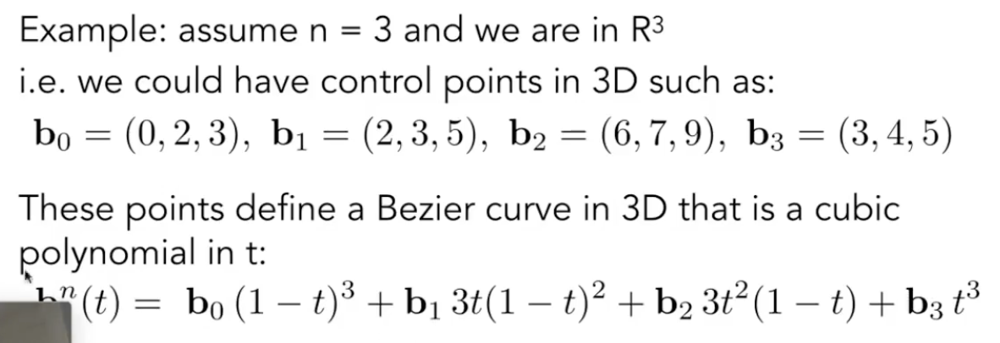
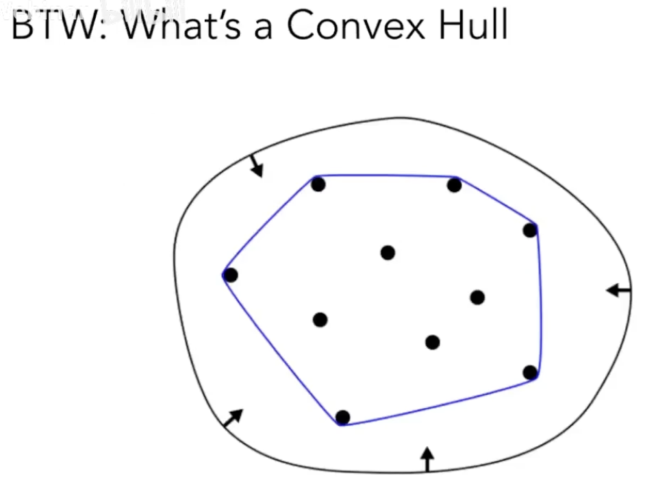
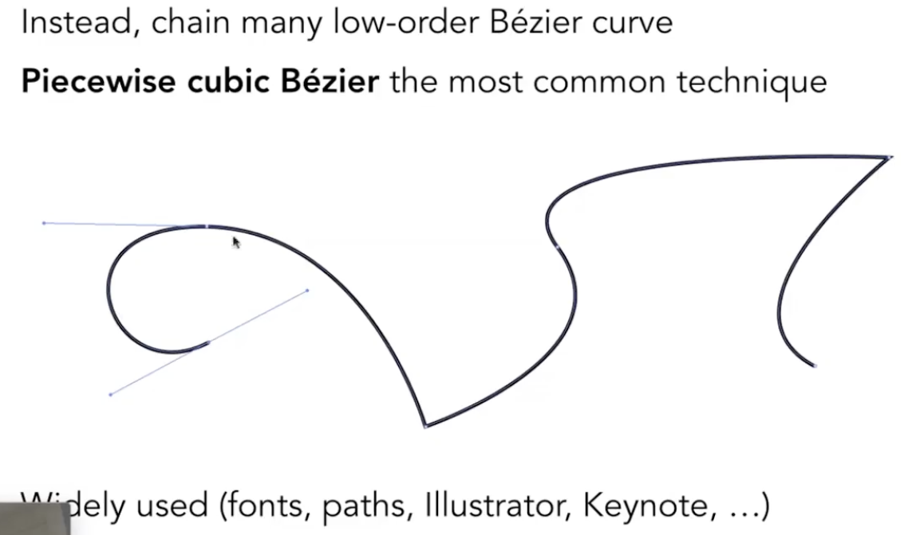
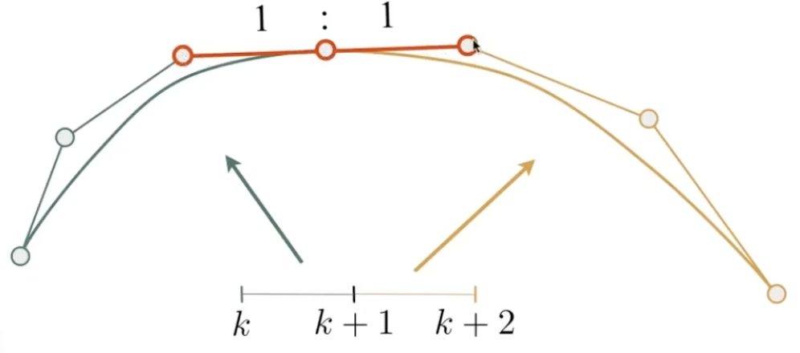
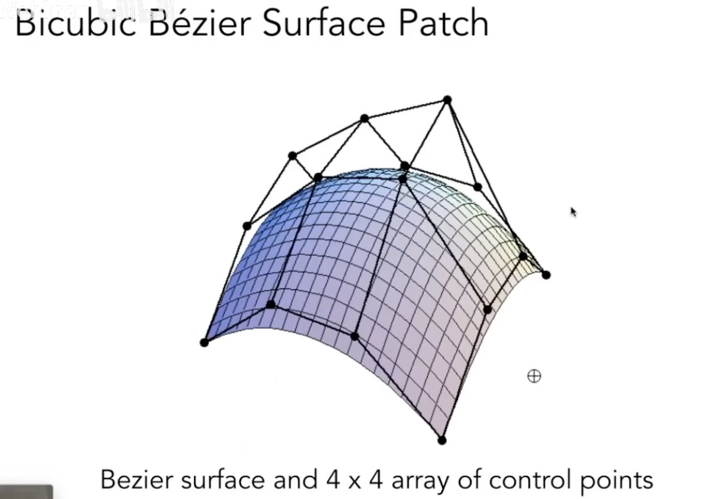
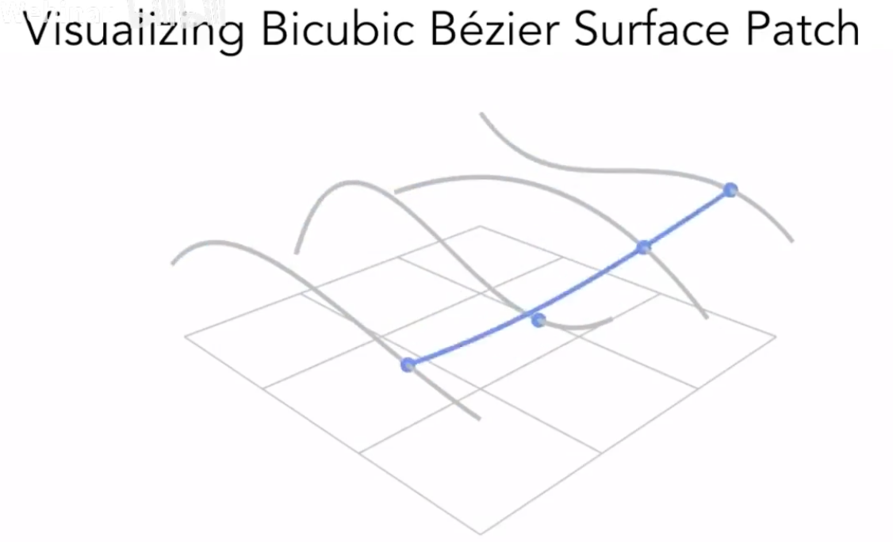

# Lecture 11 Geometry 2

## Curves

### Bezier Curves 贝塞尔曲线
1. Defining Cubic Bezier Curve with Tangents

2. Evaluating Bezier Curves (de Casteljau Algorithm)
   - Consider three points (quadratic Bezier) 三个点形成的二次贝塞尔曲线
    
    For every t between [0,1], we can find a point on the curve
   - Four input points in total: Same recursive linear interpolations
    
3. Evaluating Bezier Curves -- Algebraic Formula    
    
   - $b_0^1(t)=(1-t)b_0+tb_1$
   - $b_1^1(t)=(1-t)b_1+tb_2$
   - $b_0^2(t)=(1-t)b_0^1+tb_1^1=(1-t)^2b_0+2t(1-t)b_1+t^2b_2$
   - Bernstein form of a Bézier curve of order n (二项式展开): $b^n(t)=b_0^n(t)=\sum\limits_{j=0}^nb_jB_j^n(t)$, where $B_i^n(t)=\binom{n}{i}t^i(1-t)^{n-i}$
    
4. Properties of Bezier Curves
   - Interpolates endpoints
   - Tangent to end segments 末端相切
   - Affine transformation property 控制点经仿射变换后曲线不变
   - Convex hull property: Curve is within contex hull of control points 曲线在控制点的凸包内
    
5. Piecewise Bezier Curve 逐段贝塞尔曲线
   - 例如，没四个点控制一段贝塞尔曲线，逐段首尾相接
    
   - C^0 continuity: $a_n=b_0$
   - C^1 continuity: $a_n=b_0=\frac{1}{2}(a_{n-1}+b_1)$ . 如何使相接点光滑：使相接点两边的控制点完全对称（距离相同、一条直线）
    

### Spline 样条曲线
- a continuous curve constructed so as to pass through a given set of points and have a certain number of continuous derivatives.
- In short, a curve under control

- B-spines: Short for basis spines
   - Require more information than Bezier curves
   - Satisfy all important properties that Bezier curves have

## Surfaces
### Bezier Surfaces 贝塞尔曲面

- 类似双线性插值的思想，通过分别在横向每四个点采用贝塞尔曲线，然后在纵向上每个位置取四个曲线上的点再进行取贝塞尔曲线，得到贝塞尔曲面

### Mesh Operations: Geometry Processing 网格
- Mesh subdivision 网格细分
- Mesh simplification 网格简化
- Mesh regulatization 网格正规化（如，使三角形尽量趋于正三角形）