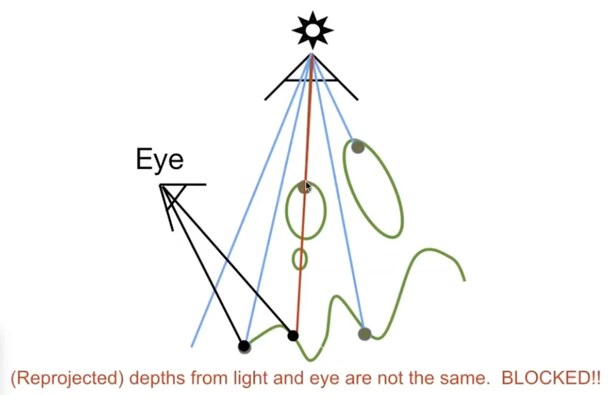

# Lecture 12 Geometry 3

## Mesh Operations: Geometry Processing 网格
1. Mesh subdivision 网格细分 (upsampling)
   - Common subdivision rule for triangle meshes
   - First, create more triangles (vertices)
   - Second, tune their positions
   - An algrithm: Loop Subdivision 先细分，再调整 (只能用作三角形面)
     - Split each triangle into four
        
     - Assign new vertex positions according to weights (New/old vertices updates differently)
       - For new vertices:
        
       - For old vertices (e.g. degree 6 vertices here): (vertex degree: 顶点的度，该点连接的边数)
        
   - Another algorithm: Catmull-Clark Subdivision 对于一般的网格(如三角形、四边形都有的网格)
     - Non-quad face: 非四边形面; 对每个面，取面的各边中点，并取面中的一个点，使其相连
        
     - 经过第一次细分后，非四边形面全部被分隔为四边形面，且增加了原本非四边形面同等个数的奇异点
        
     - 之后再进行细分后，奇异点数和非四边形数(=0)均不变 
        
     - 点的位置改动算法：FYI: Catmull-Clark Vertex Update Rules (Quad Mesh)
        
2. Mesh simplification 网格简化 (downsampling)
   - goal: reduce number of mesh elements while maintaining the overall shape 
   - An algrithm: Collapsing An Edge 边坍缩
     - Quadric Error Metrics 二次误差度量
        
     - collapse which edges? Assign score with quadric error metric
       - approximate distance to surface as sum of distances to planes containing triangles
       - iteratively collapse edge with smallest score (每次取二次误差最小的边进行坍缩，并更新其他改变的边的二次误差，用数据结构 堆)
       - greedy algorithm... great results!
3. Mesh regulatization 网格正规化（如，使三角形尽量趋于正三角形）

## Shadow Mapping 

- Key idea: the points NOT in shadow must be seen both by the light and by the camera  

1. Pass 1: Render from Light
   - depth image from light source
    
2. Pass 2A: Render from Eye
   - Standard image (with depth) from eye
    
3. Pass 2B: Project to light
   - Project visible points in eye view back to light source
    
   - If reprojected depths match for light and eye, this point is visible
    
   - If reprojected depths from light and eye are not the same, this point is blocked
4. Visualizing Shadow Mapping
    
    
    
5. Problem: Costly, cause alias, only product hard shadows
   - Hard shadows vs. soft shadows
   - umbra: 本影  penumbra: 半影
    