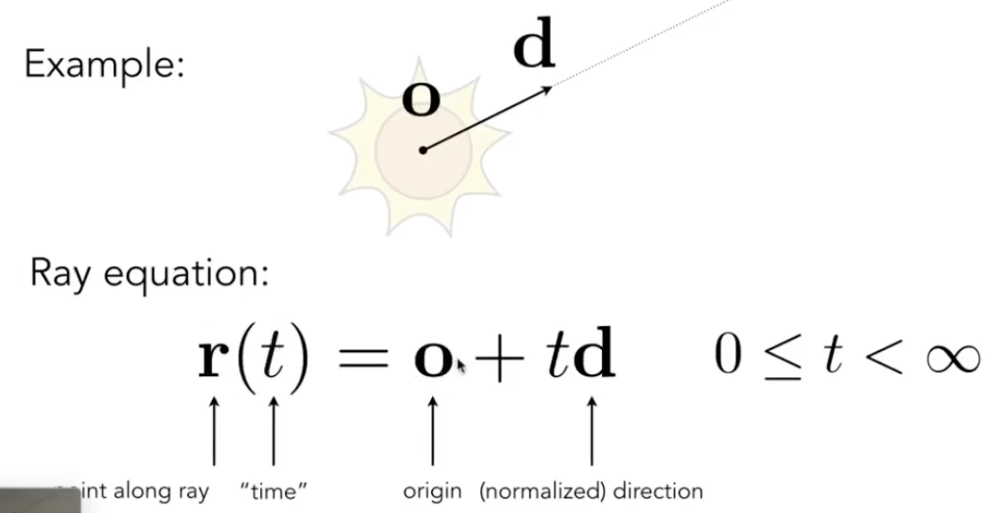

# Lecture 13 Ray Tracing 1

## Why Ray Tracing
- Rasterization couldn't handle global effects well
  - Soft shadows
  - Glossy reflection (如铜质、铁质的光亮表面)
  - especially when the light bounces more than once (indirect illumination)

- Rasterization is fast, but quality is relatively low

- Ray tracing is accurate, but is very slow
  - Rasterization: real-time, Ray tracing: offline
  - ~10K CPU core hour to render one frame in production

## Basic Ray Tracing Algorithm
1. Light Rays
   - Light travels in straight lines
   - Light rays do not "collide" with each other if they cross
   - Light rays travel from the light sources to the eye

2. Ray Casting
   - Generate an image by casting one ray per pixel
   - Check for shadows by sending a ray to the light
   - Pinhole Camera Model
    

## Recursive (Whitted-Style) Ray Tracing
   
1. Ray-Surface Intersection
   - Ray Equation
     - Ray is defined by its origin and a direction vector
      
   - Ray intersection with sphere
     - Ray: $\textbf{r}(t)=\textbf{o}+t\textbf{d}, 0\le t<\infty$
     - Sphere: $\textbf{p}:(\textbf{p}-\textbf{c})^2-R^2=0$
     - Solve for intersection: $(\textbf{o}+t\textbf{d}-\textbf{c})^2-R^2=0$
      
   - Ray Intersection with Implicit Surface
     - Ray: $\textbf{r}(t)=\textbf{o}+t\textbf{d}, 0\le t<\infty$ 
     - General implicit surface: $\textbf{p}:f(\textbf{p})=0$
     - Substitute ray equation: $f(\textbf{o}+t\textbf{d})=0$ 
      
   - Ray Intersection With Triangle Mesh
     - Simple idea: just intersect ray with each triangle
     - Simple, but slow (can be accelerated)
     - Note: can have 0,1 intersections (ignoring multiple intersections)
     - Triangle is in a plane, first intersect with the plane, then test if the hit point is in the triangle
   - Plane Equation: Plane is defined by normal vector $\textbf{N}$ and a point $\textbf{p'}$ on plane
     - $\textbf{p}:(\textbf{p}-\textbf{p'})\cdot \textbf{N}=0 \space \space \space \space ax+by+cz+d=0$
   - Ray Intersection With Plane:
    
   - Moller Trumbore Algorithm
    
   - Accelerating Ray-Surface Intersection 加速
     - Bounding Volumes 包围盒: Quick way to avoid intersections: bound complex object with a simple volume
        
     - Ray-intersection with box
       - understanding: box is the intersection of 3 pairs of slabs 长方体是三组对面形成的交集
       - Specifically: We often use an Axis-Aligned Bounding Box(AABB) 轴对齐包围盒 i.e. any side of the BB is along either x,y, or z axis
       - Ray Intersection with Axis-Aligned Box (2D)
        
        求两条线段的交集
       - Ray Intersection with Axis-Aligned Box (3D)
         - The ray endters the box only when it enters all pairs of slabs
         - The ray exits the box as long as it exits any pair of slabs
         - For each pair, calculate the $t_{min}$ and $t_{max}$ (negative is fine)
         - For the 3D box, $t_{enter}=\max \{t_{min}\}, t_{exit}=\min\{t_{max}\}$
         - If $t_{enter}<t_{exit}$, we know the ray stays a while in the box (so they must intersect!)
         - However, we should check whether t is negative
           - If $t_{exit}<0$: The box is "behind" the ray - no intersection
           - If $t_{exit}\ge0 \space and \space  t_{enter}<0$: The ray's origin is inside the box - have intersection
         - In summary, ray and AABB intersect iff(当且仅当) $t_{enter}<t_{exit} \space \&\& \space t_{exit} \ge 0$
       - Why Axis-Aligned?  简化计算
        