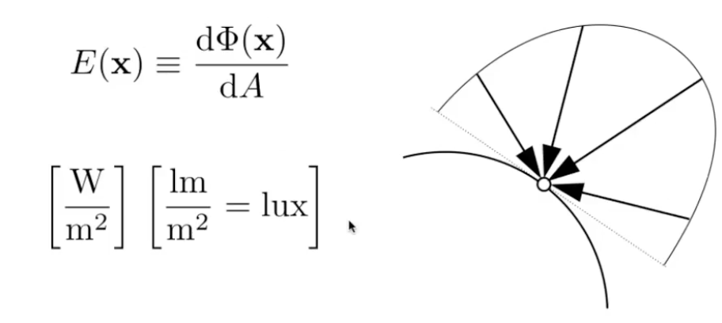

# Lecture 14 Ray Tracing 2

## Using AABBs to accelerate ray tracing 
- Preprocess -- build acceleration grid
    

- Ray-Scene Intersection
     
   - Heuristic: #cells = C * #objs  C can be 27 in 3D   划分的格子数量和物体数量成正比
   - Problem: "Teapot in a stadium" 对于大规模的集中和大规模的空白处理较差

### Spatial Partitions

1. KD-Tree
    
   - Data Structure for KD-Trees
     - Internal nodes store:
       - split axis: x-, y-, or z-axis
       - spilt position: coordinate of split plane along axis
       - children: pointers to child nodes
       - No objects are stored in internal nodes
     - Leaf node store:
       - list of objects
   - Traversing a KD-Tree: 从根开始，依次判断与方格是否有交点，若有则接着判断其子结点，若是叶子结点，则开始计算是否与其内部的物体有交点
   - Problem: 
     - 难以计算三角形和一个AABB是否有交点，建立KD-Tree并不简单
     - 一个物体可能出现在多个叶子结点中

### Object Partition

2. Object Partitions & Bounding Volume Hierarchy (BVH)
   - 以物体为基准进行划分
   - 一个物体只能出现在一个盒子中
   - 并没有将空间严格划分开，应尽可能地将空间划分出来
    
   - Steps
     - Find bouding box
     - Recursively split set of objects in two subsets
     - Recompute the bounding bix of the subsets
     - Stop when necessary
     - Store objects in each leaf node
   - How to subdivide a node?
     - Choose a dimension to split
     - Heuristic #1: Always choose the longest axis in node
     - Heuristic #2: Split node at location of median object 使两部分中的三角形数量差不多
       - goal: 找到三角形的中位数  
       - algorithm: 快速选择
   - Termination criteria
     - Heuristic: stop when node contains few elements (e.g. 5)
- 

## Basic Radiometry 辐射度量学
1. Motivation
   - we ignored the true meaning of light intensity
   - Whitted style ray tracing does not give CORRECT results

2. Radiometry
   - Measurement system and units for illumination
   - Accurately measure the spatial properties of light
     - New terms: Radiant flux, intensity, irradiance, radiance
   - Perform lighting calculations in a physically correct manner

3. Radiant Energy and Flux (Power)
   - Definition: Radiant energy is the energy of electromagnetic radiation. It is measured in units of joules, and denoted by the symbol: $Q \space [J=Joule]$
   - Definition: Radiant flux (power) is the energy emitted,reflected, transmitted or received, per unit time ; or photons(光子) flowing through a sensor in unit time
    

4. Radiant Intensity
   - Definition: The radiant (luminous) intensity is the power per unit solid angle (立体角) emitted by a point light source.
    
   - Angles: ratio of subtended arc length on circle to radius
     - $\theta = \frac{l}{r}$
     - Circle has $2\pi$ radians
   - Solid angle: ratio of subtended area on sphere to radius squared
     - $\Omega = \frac{A}{r^2}$
     - Sphere has $4\pi$ steradians
     - Differential Solid Angles 单位/微分立体角
        
        $\Omega = \int_{S^2}d\omega = \int_{0}^{2\pi} \int_{0}^{\pi}\sin{\theta}\space d\theta \space d\phi = 4\pi$
   - Isotropic Point Source 各向同性点源
     - $\phi = \int_{S^2}I \space d\omega = 4\pi I$
     - $I= \frac{\phi}{4\pi}$

5. Irradiance
   - Definition: The irradiance is the power per (perpendicular/projected 垂直/投影) unit area incident on a surface point.
    
    
   - Irradiance Falloff:
    

6. Radiance
   - Definition: The radiance (luminance) is the power emitted, reflected, transmitted or received by a surface, per unit solid angle, per projected unit area
   - Radiance is the fundamental field quantity that describes the distribution of light in an environment
    
   - Radiance = Irradiance per solid angle
   - Radiance = Intensity per projected unit area
    

