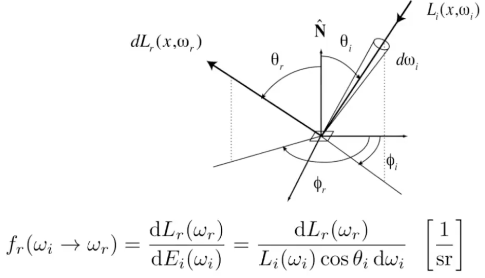
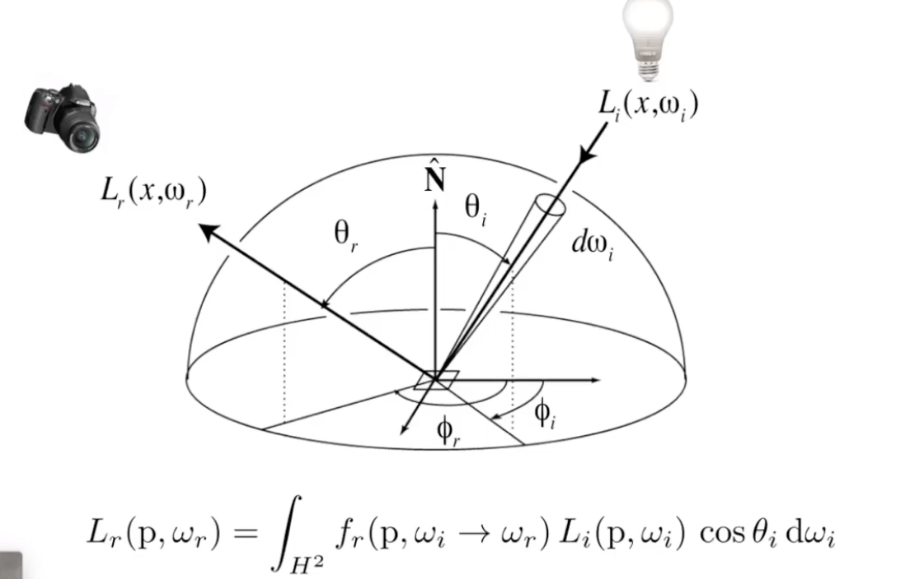
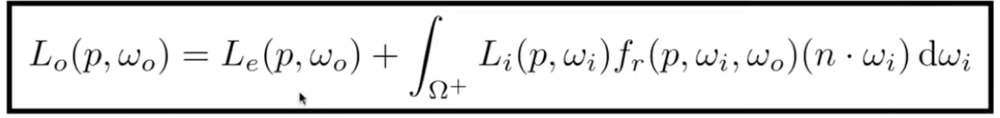
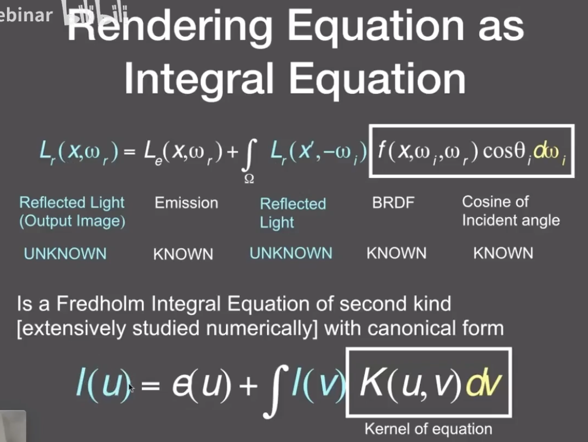
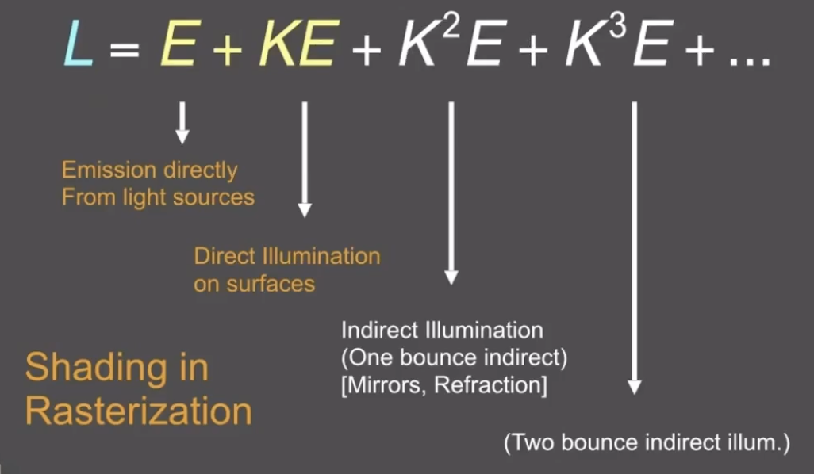
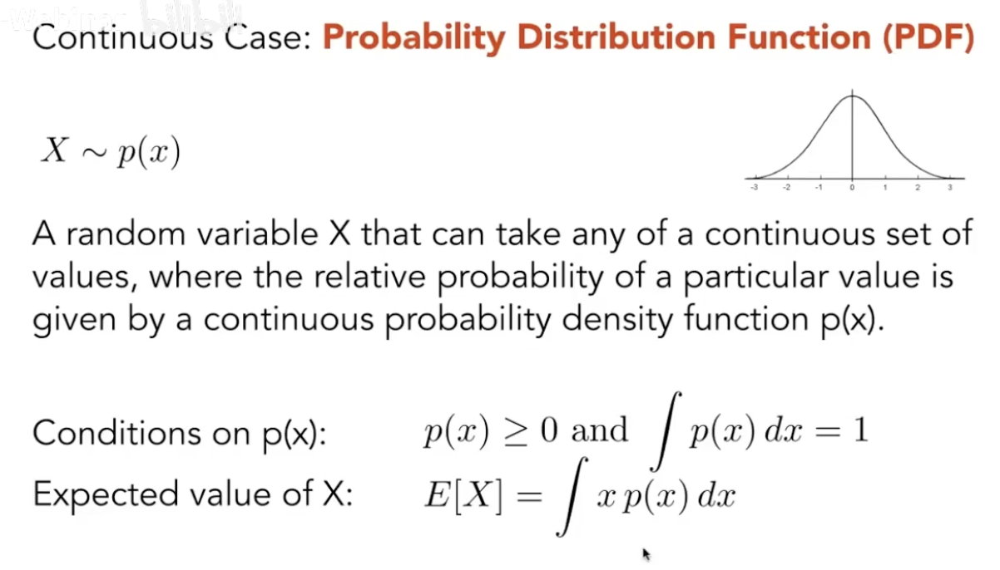

# Lecture 15 Ray Tracing 3

## Rendering Equation

1. Bidirectional Reflectance Distribution Function (BRDF) 双向反射分布函数
   - Reflection at a point: Radiance from direction $\omega_i$ turns into the power E that dA receives, Then power E will become the radiance to any other direction $\omega_o$
     - Differential irradiance incoming: $dE(\omega_i)=L(\omega_i)\cos\theta_i d\omega_i$
     - Differential radiance exiting (due to $dE(\omega_i)$): $dL_r(\omega_r)$
   - BRDF: represents how much light is reflected into each outgoing direction $\omega_r$ from each incoming direction
    
   - 对于每一个入射方向:
    
   - Challenge: Recursive Equation: Reflexted radiance depends on incoming radiance, but incoming radiance depends on reflected radiance (at another point in the scene)

2. The Rendering Equation 渲染方程: 加上物体自身的发光
    
    ($H^2$和$\Omega^+$都表示半球)
    
    - 再简化：$L=E+KL$
    - 递归运算：$L=E+KE+K^2E+K^3E+...$
    

## Probability Review
