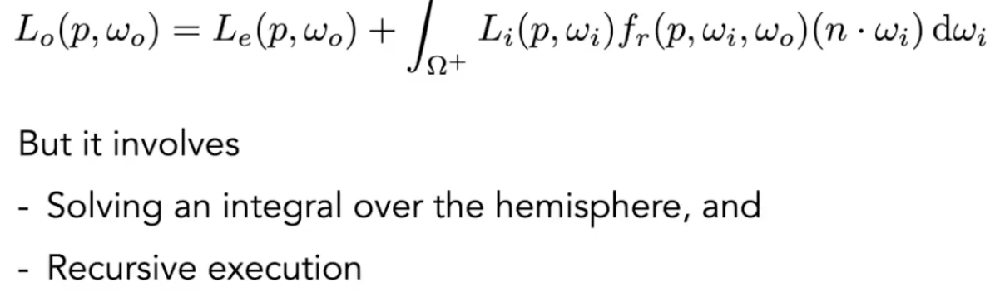
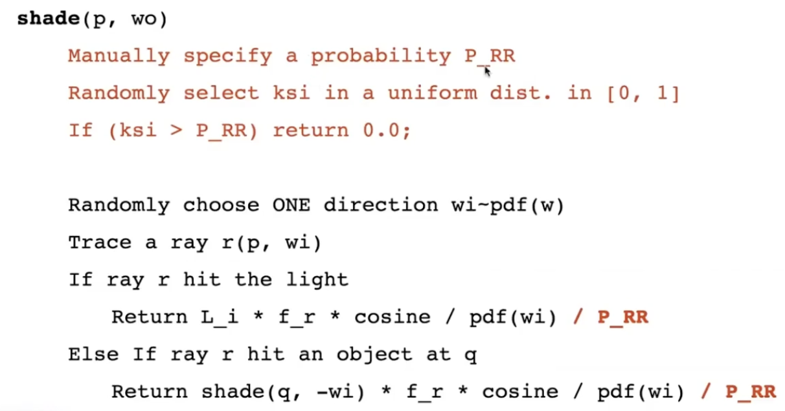

# Lecture 16 Ray Tracing 4 (Monte Carlo Path Tracing)

## Monte Carlo Integration 蒙特卡洛积分

- Why: we want to solve an integral, but it can be too difficult to solve analytically

1. Monte Earlo estimator
   - Definite integral: $\int_{a}^{b}f(x)dx$
   - Random variable: $X_i$ ~ $p(x)$
   - Monte Carlo estimator: $F_N=\frac{1}{N}\sum_{i=1}^{N}\frac{f(X_i)}{p(X_i)}$

2. Example: Uniform Monte Carlo Estimator
   - Definite integral: $\int_{a}^{b}f(x)dx$
   - Uniform random variable: $X_i$ ~ $p(x)=\frac{1}{b-a}$
   - Basic Monte Carlo estimator: $F_N=\frac{b-a}{N}\sum_{i=1}^{N}f(X_i)$

3. Some notes:
   - The more samples, the less variance 
   - Sample on x, integrate on x

## Path Tracing 路径追踪

1. Motivation: 
   - Whitted-Style Ray Tracing:
     - Always perform specular reflections/refractions
     - Stop bouncing at diffuse surfaces
   - High Level:
     - progressively improve upon Whitted-Style Ray Tracing and lead to our path tracing algorithm
   - Problem 1: Where should the ray be reflected for glossy materials?
   - Problem 2: No reflections between diffuse materials?
   - Whitted-Style Ray Tracing is Wrong, but the rendering equation is correct
    

2. A simple Monte Carlo Solution
   - Suppose we want to render one pixel in the following scene for direct illumination only:
    
    
     - Using Monte Carlo Integration: 
        
        
     - So the code should be:
        
3. One more step forward: what if a ray hits an object?

   - Introducing Global Illumination 全局光照，递归解决
      
      Is the problem done? NO!
   - Problem 1: Explosion of rays as bounces go up:  $\#rays = N^{\#bounces}$
     - Solution: #rays will not explode iff N==1
      
      This is called path tracing
     - But this will be noisy!
     - Solution: just trace more paths through each pixel and average their radiance
      
   - Problem 2: The light does not stop bouncing indeed
     - solution: Russian Roulette 俄罗斯轮盘赌
      
      
      Now we already have a correct version of path tracing! But it's not really efficient.
        

4. Sampling the Light
   - The reason of being inefficient: 
    
   - Monte Carlo methods allows any sampling methods, so we can sample the light (therefore no rays are "wasted")
   - Assume uniformly sampling on the light: pdf=1/A (because $\int pdf \space dA =1$); But the rendering equation integrates on the solid angle, we can't use Monte Carlo integration to compute. (Sample on x & integrate on x)
     - Since we sample on the light, can we integrate on the light?
     - Need the relationship between $d\omega$ and $dA$
     - Easy! Projected are on the unit sphere
     - $d\omega=\frac{dA \cos \theta'}{||x'-x||^2}$
        
   - Now we consider the radiance coming from two parts:
     - light source (direct, no need to have RR)
     - other reflectors (indirect, RR)
        
   - One final thing: how do we know if the sample on the light is not blocked or not?
     - shoot a ray from p to x', if the ray is not blocked in the middle, then...
   - Point Light Source is difficult to handle

5. Ray tracing: Previous vs. Modern Concepts
   - Previous
     - Ray tracing == Whitted-style ray tracing
   - Modern (own definition)
     - The general solution of light transport, including
     - (Unidirectional & bidirectional) path tracing
     - Photon mapping
     - Metropolis light transport
     - VCM / UPBP...