# Lecture 17 Materials and Appearances

## What is Material in Computer Graphics

### Material == BRDF

1. Diffuse/Lambertian Material
   - Light is equally reflected in each output direction
   - 能量守恒: irradiance 不变
    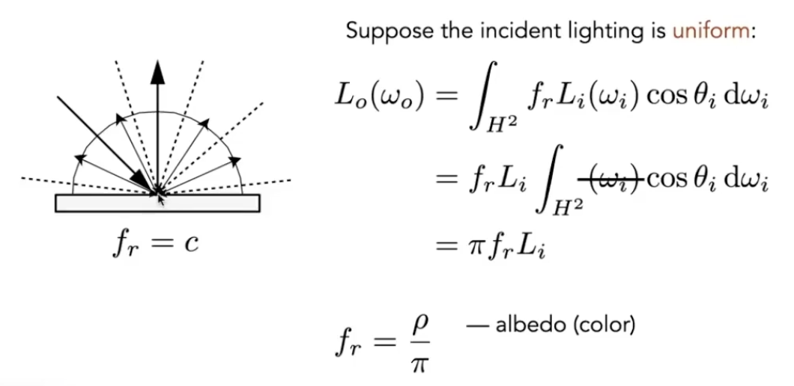
    albedo: 反射率

2. Glossy material 

3. Ideal reflective / refravtive material
   - perfect specular reflection
    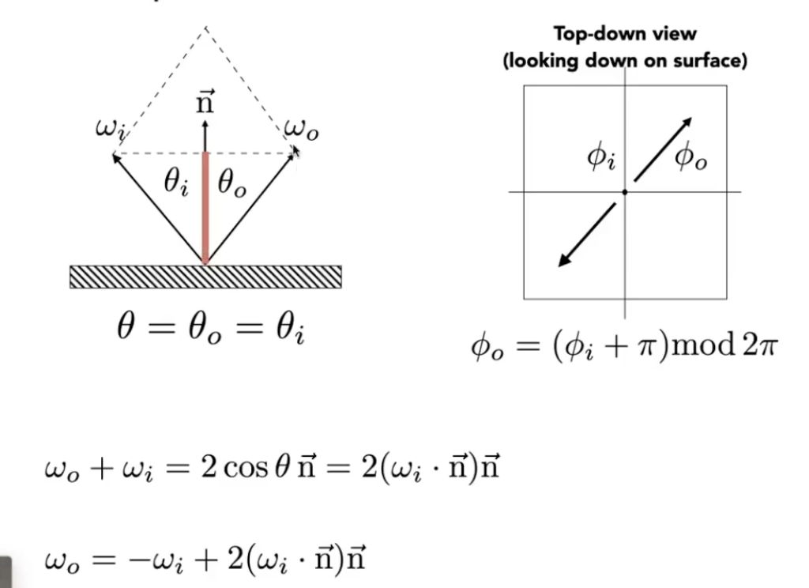
    方向由theta和phi共同定义
   - specular refraction 折射
    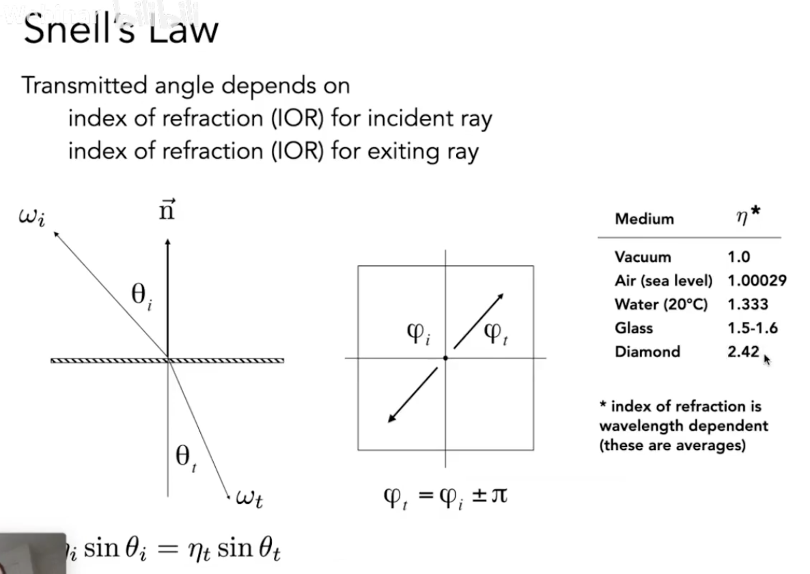
   - Fresnel Reflection/Term 菲涅耳项
    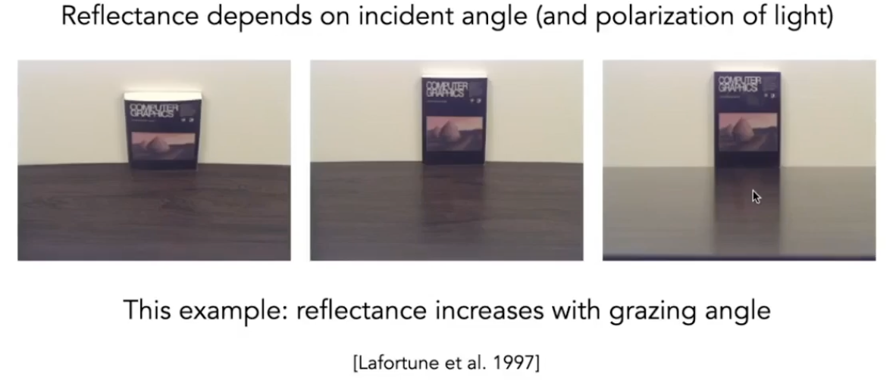
    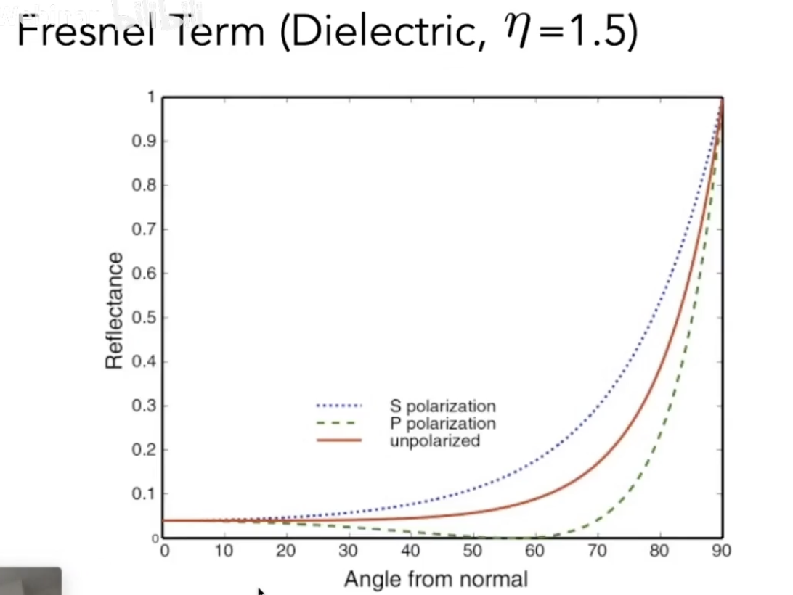
    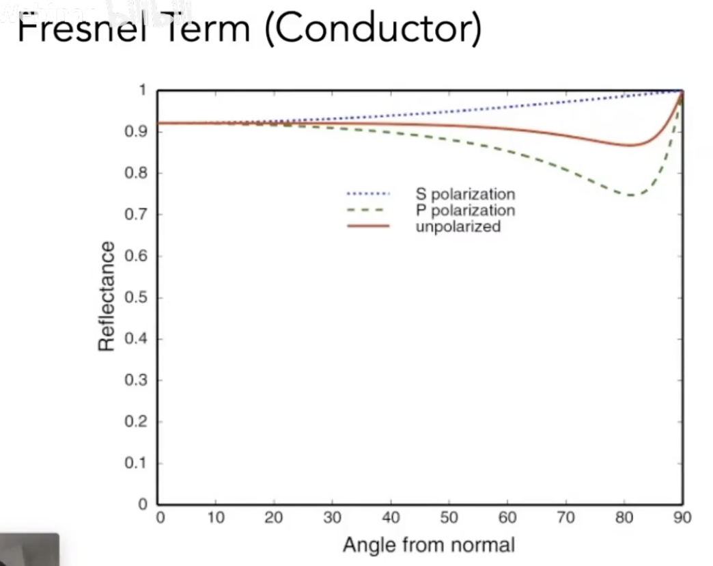
    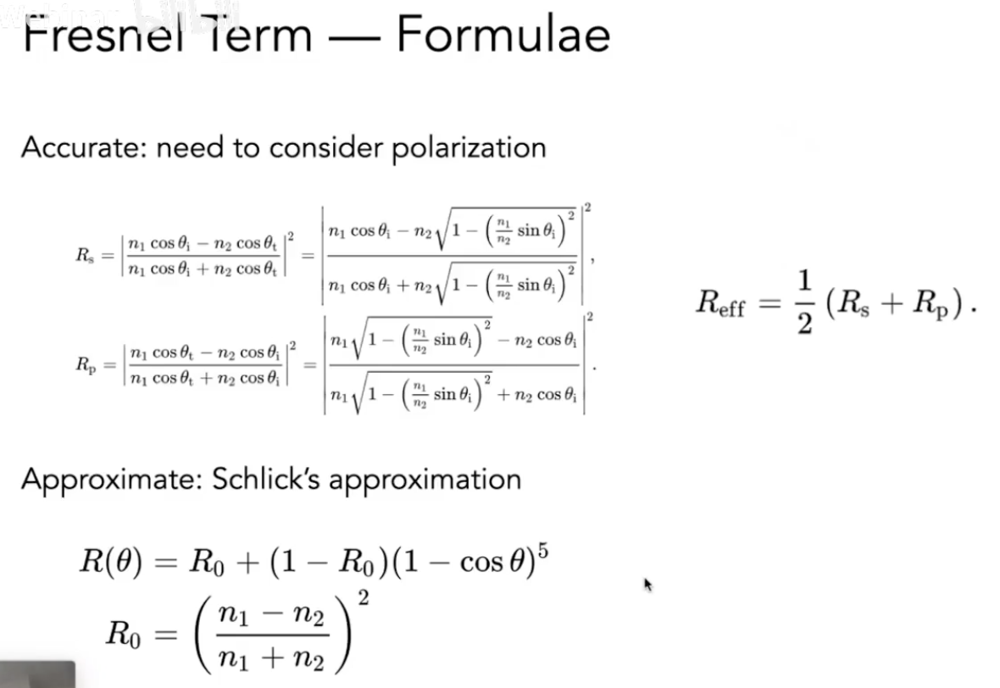

4. Microfacet Material 微表面模型: 忽略远处物体表面的粗糙
   - Rough surface
     - Macroscale: flat & rough
     - Microscale: bumpy & specular
   - Individual elements of surface act like mirrors
     - Known as Microfacets
     - Each microfacet has its own normal
   - Microfacet BRDF
     - key: the distribution of microfacets' normal
        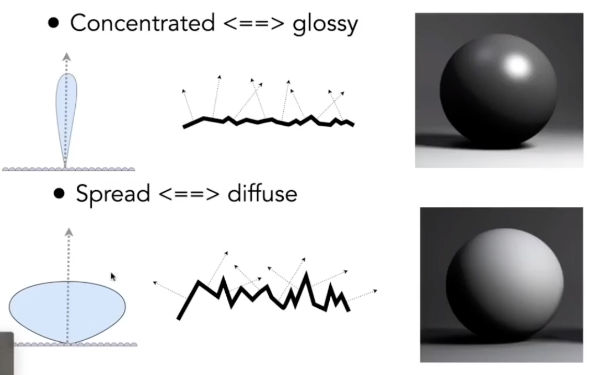
        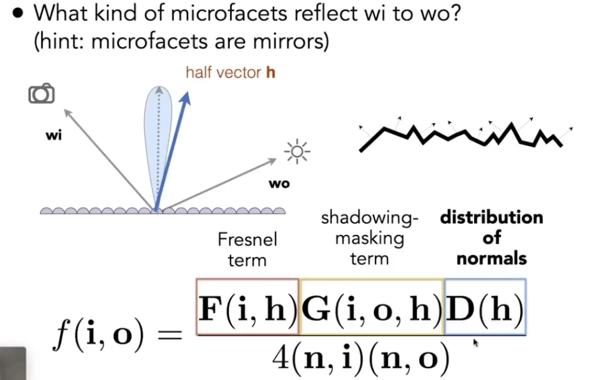

5. Isotropic/Anisotropic Materials 各向同性/各向异性
   - Key: directionality of underlying surface
    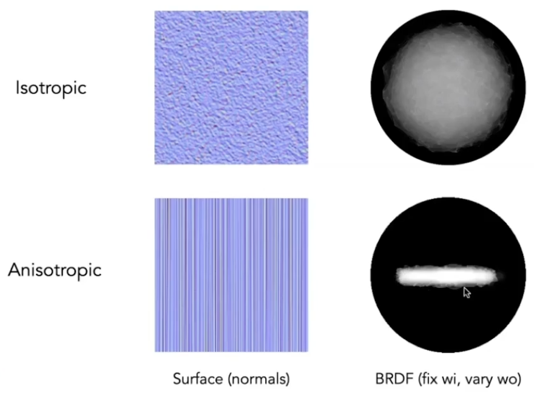
   - Anisotropic BRDFs: Reflection depends on azimuthal angle $\phi$
     - $f_r(\theta_i,\phi_i;\theta_r,\phi_r) != f_r(\theta_i,\theta_r,\phi_r-\phi_i)$
     - Results from oriented microstructure of surface, e.g., brushed metal
        

6. Properties of BRDFs
   - Non-negativity: $f_r(\omega_i->\omega_r)\ge 0$
   - Linearity: $L_r(p,\omega_r)=\int_{H^2}f_r(p,\omega_i->\omega_r)L_i(p,\omega_i)\cos\theta_id\omega_i$
   - Reciprocity principle 可逆性: $f_r(\omega_r->\omega_i)=f_r(\omega_i->\omega_r)$
   - Energy conservtion 能量守恒: $\forall\omega_r\int_{H^2}f_r(\omega_i->\omega_r)\cos\theta_id\omega_i\le 1$
   - Isotropic v.s. anisotropic
   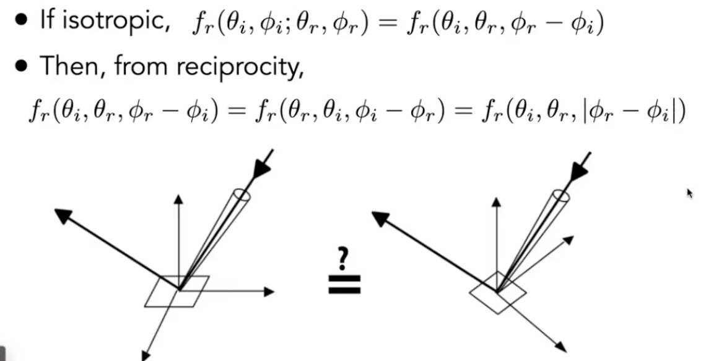

7. Measuring BRDFs
   - Motivation
   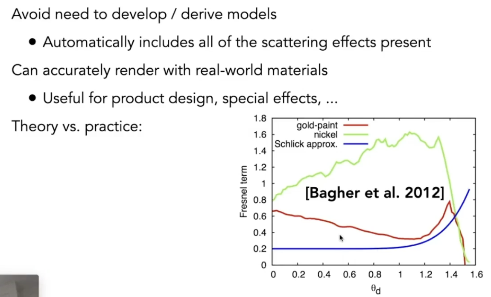
   - Image-Based BRDF Measurement
   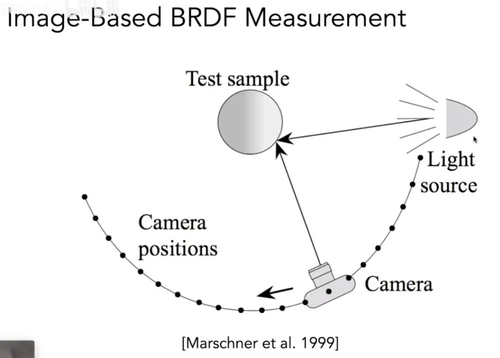
   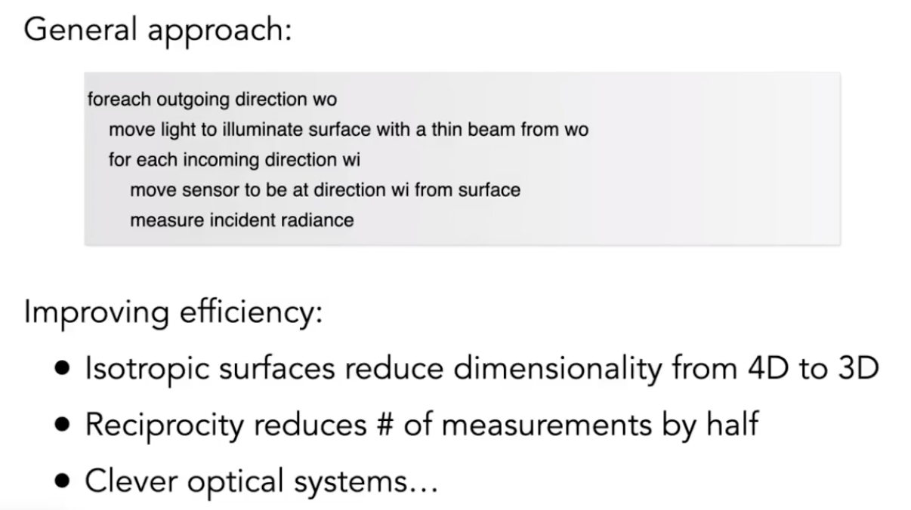
   - Tabular Representation
   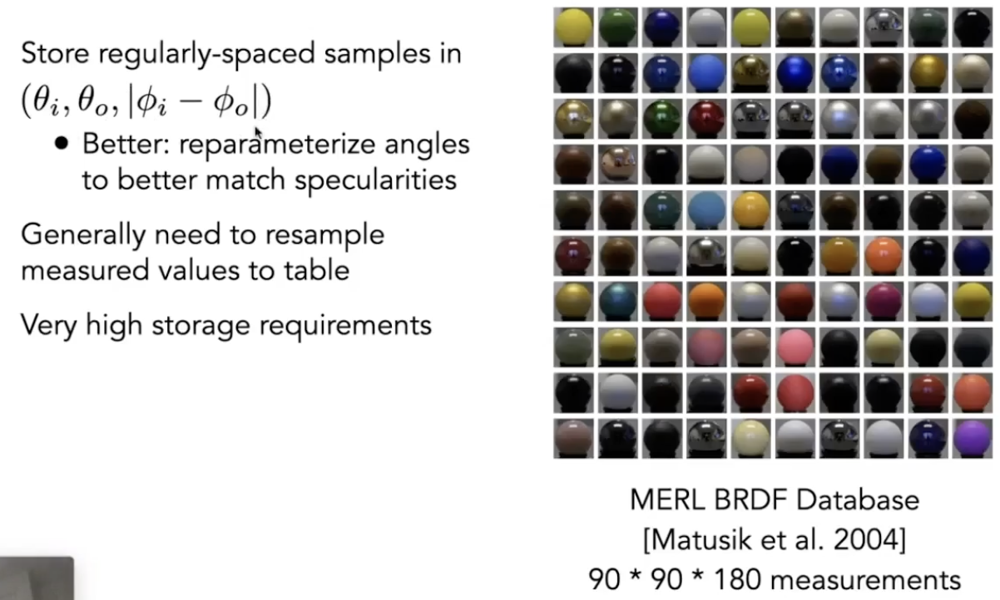