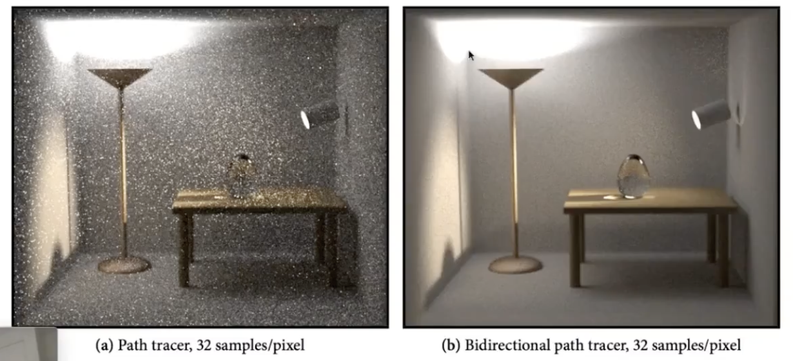

# Lecture 18 Advanced Topics in Rendering

## Advanced Light Transport

### Unbiased light transport methods
- An unbiased Monte Carlo technique does not have any systematic error
- The expected value of an unbiased estimator will always be the correct value, no matter how many samples are used

1. Bidirectional Path Tracing (BDPT)
    
   - Suitable if the light transport is complex on the light's side
   - Difficult to implement & quite slow
    

2. Metropolis Light Transport (MLT)
   - A Markov Chain Monte Carlo (MCMC) application
     - Jumping from the current sample to the next eith some PDF
   - Very good at locally exporing difficult light paths
   - Key idea
     - Locally perturb an existing path to get a new path
   - Works great with difficult light paths
   - Cons:
     - Difficult to estimate the convergence rate
     - Does not guarantee equal convergence rate per pixel
     - So, usually produces "dirty" results
     - Therefore, usually not to render animations

   

### Biased light transport methods
- One special case, the expected value converges to the correct value as infinite #samples are used — consistent
- Biased == blurry
- Consistent == not blurry with infinite #samples

1. Photon Mapping 光子映射
   - A biased approach & A two-stage method
   - Very good at handling Specular-Diffuse-Specular (SDS) paths and generating caustics
    
   - Stage 1 - Photon tracing
     - Emitting photons from the light source, bouncing them around, then recording photons on diffuse surfaces
   - Stage 2 - Photon collection (final gathering)
     - Shoot sub-paths from the camera, bouncing them around, until they hit diffuse surfaces
   - Caculation - local density estimation 
     - Idea: areas with more photons should be brighter
     - For each shaing point, find the nearest N photons. Take the surface area they cover
   - Why biased?
     - Local Density Estimation: $dN/dA != \Delta N/\Delta A$
     - But in the sense of limit
       - More photons emmitted ->
       - The same N photons cover a smaller $\Delta A$ ->
       - $\Delta A$ is closer to $dA$
     - So, it is biased but consistent

2. Vertex Connection and Merging (VCM)
   

3. Instant radiosity (IR/VPL/many light methods)

- Pros: fast and usually gives good results on diffuse scenes
- Cons:
  - Spikes will emerge when VPLs are close to shading points
  - Cannot handle glossy materials

## Advanced Appearance Modeling

### Non-surface models
1. Participating media 反射介质
   - At any point as light travels through a participating medium, it can be (partially) absorbed and scattered
   - Use Phase Function to describe the angular distribution of light scattering at any point x within participating media
   - Rendering: 
     - Randomly choose a direction to bounce
     - Randomly choose a distance to go straight
     - At each 'shading point', connect to the light

2. Hair,fur,fiber (BCSDF)
   - Marschner Model (for human hair)
    
    
    
   - Double Cylinder Model (for animal fur)
    
    Medular may exert scatter

3. Granular material 颗粒状

### Surface models

1. Translucent material (BSSRDF) (半透明，如玉、大理石、人的皮肤)
   - Subsurface Scattering 次表面散射
     - Visual characteristics of many surfaces caused by light exiting at different points than it enters
     - Violates a fundamental assumption of the BRDF
   - BSSRDF: generalization of BRDF; exitant radiance at one point due to incident differential irradiance at another point: $S(x_i,\omega_i,x_o,\omega_o)$
   - Generalization of rendering equation: integrating over all points on the surface and all directions (!)
    
   - Dipole Approximation: Approximate light diffusion by introducing two point sources
    

2. Cloth
   - A collection of twisted fibers 缠绕的纤维
     - Two levels of twist: 缠绕成股
      
     - Woven or knitted 编织
   - Render as surface: calculate the overall behavior; render using a BRDF: have some limination
   - Render as Participating Media
     - Properties of individual fibers & their distribution -> scattering parameters
   - Render as Actual Fibers
     - render every fiber explicitly!

3. Detailed material (non-statistical BRDF)
   - Motivation: not very realistic 细小的划痕、各向异性
   - Difficult to render as path tracing

### Procedural appearance 程序化生成

- Can we define details without textures?
  - Compute a noise function on the fly
  - 3D noise -> iternal structure if cut or broken