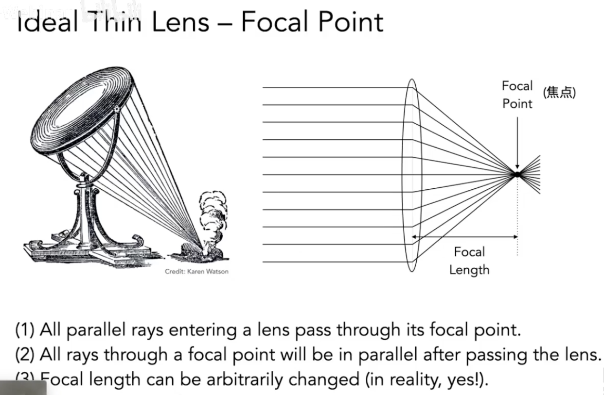

# Lecture 19 Cameras,Lenses and Light fields

## Cameras
- Pinholes & Lenses From Image on Sensor
- Shutter Exposes Sensor For Precise Duration
- Sensor Accumulates Irradiance During Exposure
   - Why Not Sensors Without Lenses? 
   - Each sensor point would integrate light from all points on the object, so all pixel values would be similar
   - The sensor records irradiance

1. Pinhole Image Formation
2. Field of View (fov)
   
   
   
   

3. Exposure 曝光
   
   
   
   
   
   
   
   
   

## Lens

1. Ideal thin lens - focal point
   
   

2. Defocus blur
   
   
   

3. Ray Tracing Ideal Thin Lenses
   
   

4. Depth of Field
   
   

## Light Field / Lumigraph