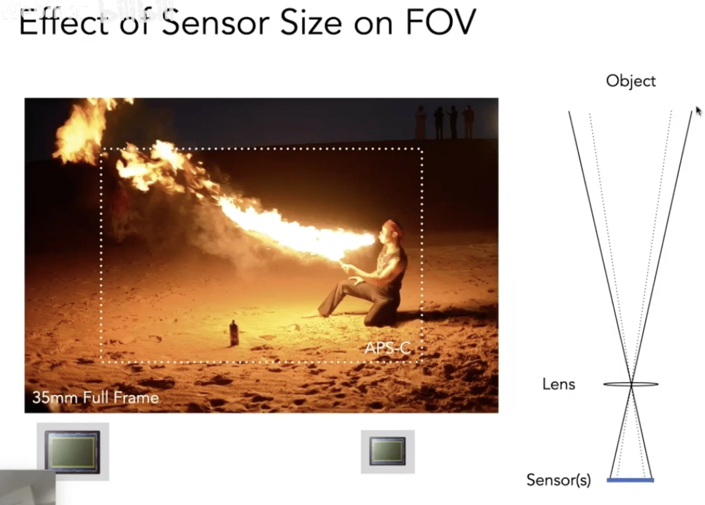
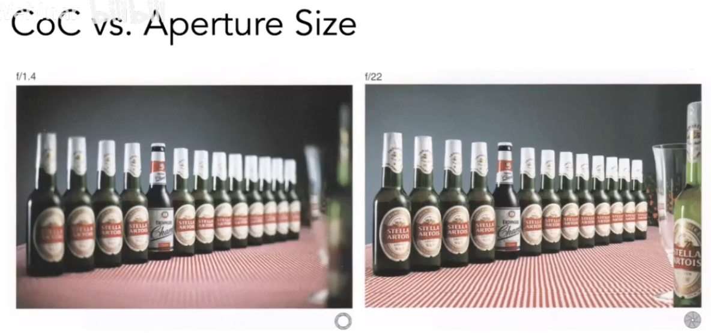
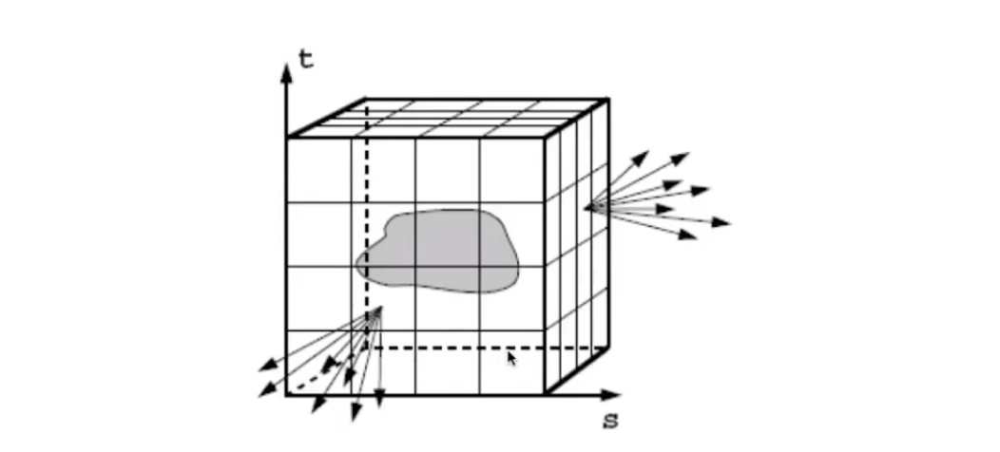

# Lecture 19 Cameras,Lenses and Light fields

## Cameras
- Pinholes & Lenses From Image on Sensor
- Shutter Exposes Sensor For Precise Duration
- Sensor Accumulates Irradiance During Exposure
   - Why Not Sensors Without Lenses? 
   - Each sensor point would integrate light from all points on the object, so all pixel values would be similar
   - The sensor records irradiance

1. Pinhole Image Formation
2. Field of View (fov)
   
   
   
   

3. Exposure 曝光
   
   
   
   
   
   
   
   
   

## Lens

1. Ideal thin lens - focal point
   
   

2. Defocus blur
   
   
   

3. Ray Tracing Ideal Thin Lenses
   
   

4. Depth of Field
   
   

## Light Field / Lumigraph 光场

1. A movie
   - $P(\theta,\phi,\lambda,t)$ is intensity of light
     - seen from a single viewpoint
     - over time
     - As a function of wavelength

2. Holographic movie
   - $P(\theta,\phi,\lambda,t,V_x,V_y,V_z)$ ....
     - seen from any viewpoint
     - The Plenoptic Function
       - Can reconstruct every possible view, at every moment, from every position, at every wavelength
       - Contains every photograph, every movie, everything that anyone has ever seen! it completely captures our visual reality! Not bad for a function...

3. Ray Reuse
   - infinite line: Assume light is constant (vacuum)
   - 4D
     - 2D direction
     - 2D position
     - non-dispersive medium
   - Only need plenoptic surface
     - The surface of a cube holds all the radiance iinformation due to the enclosed object
      
      
      

4. Light Field Camera
   - Computing Refocusing (virtually changing focal length & aperture size)
   - Each pixel(irradiance) is now stored as a block of pixels (radiance)
   - A close-up view of a picture taken
   - How to get a regular photo from the light field photo?
     - A simple case -- always choose the pixel at the bottom of each block
     - Then the central ones & the top ones
     - Essentially moving the camera around
   - Computational / digital refocusing
     - Same idea: visually changing focal length, picking the refocused ray directions accordingly
     - The light field contains anything
   - Problems:
     - Insufficient spatial resolution 分辨率不足
     - High cost -- intricate designation of micro lenses
     - Compute Graphics is about trade-offs