# Lecture 20 Color and Perception

## Physical Basis of Color

1. The Visible Spectrum of Light
   - Electromagnetic radiation
     - Oscillations of different frequencies (wavelengths)
   - Spectral Power Distribution (SPD)
    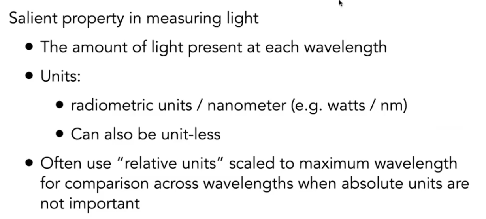
   - Linearity of Spectral Power Distribution
    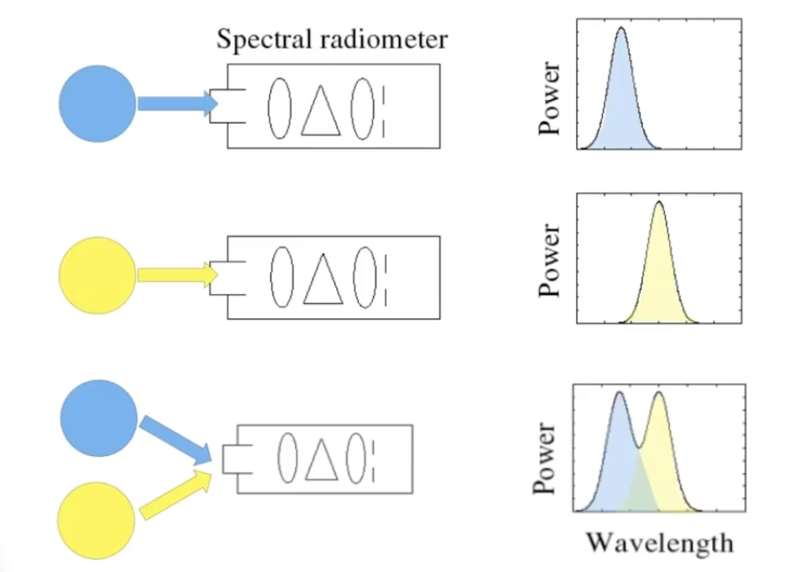

2. What is Color
   - Color is a phenomenon of human perception; it is not a universal property of light
   - Different wavelengths of light are not "colors"
  
3. Biological Basis of Color 
    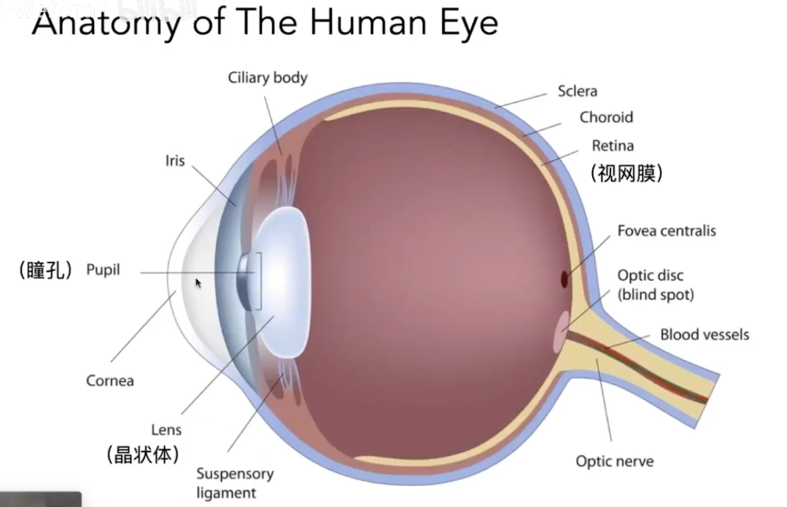
   - Retinal Photoreceptor Cells: Rods and Cones
     - Rods are primary receptors in very low light ("scotopic" conditions), e.g. dim moonlight
     - Cones are primary receptors in typical light levels ("photopic")
        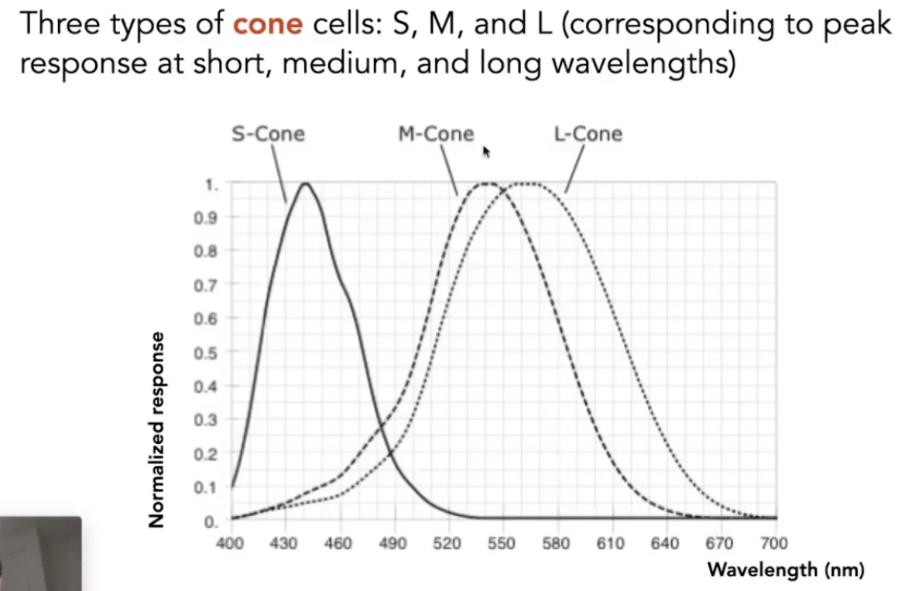
     - Fraction of three cone cell types varies widely
    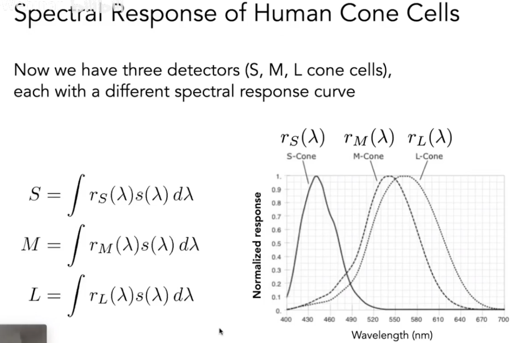
   - The Human Visual System
    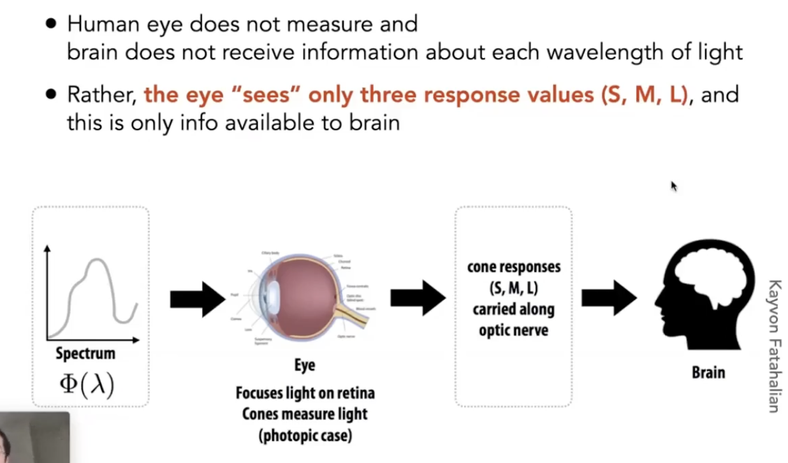
   - Metamerism 同色异谱 
    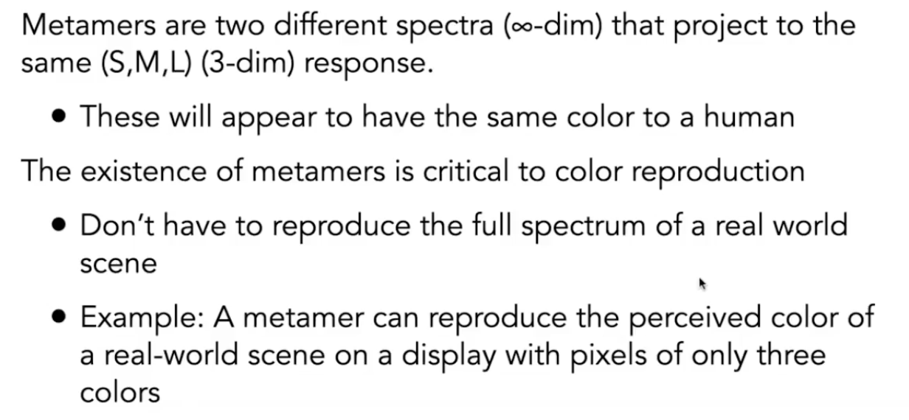

4. Color Reproduction/Matching
   - Additive Color
     - Given a set of primary lights, each with its own spectral distribution (e.g. R,G,B display pixels): $s_R(\lambda), s_G(\lambda), s_B(\lambda)$
     - Adjust the brightness of these lights and add them together: $R s_R(\lambda)+Gs_G(\lambda)+Bs_B(\lambda)$
     - The color is now described by the scalar values: R,G,B
     - CIE RGB Color Matching Expwriment
        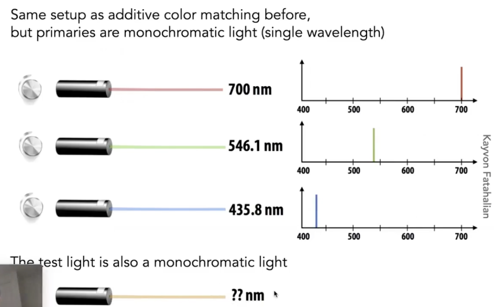
       - For any spectrum s, the perceived color is matched by the following formulas for scaling the CIE RGB primaries
        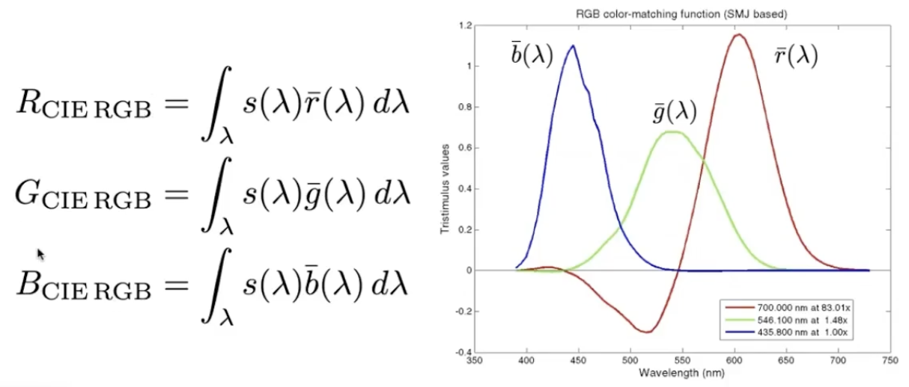
     - A Universal Color Space: CIE XYZ
        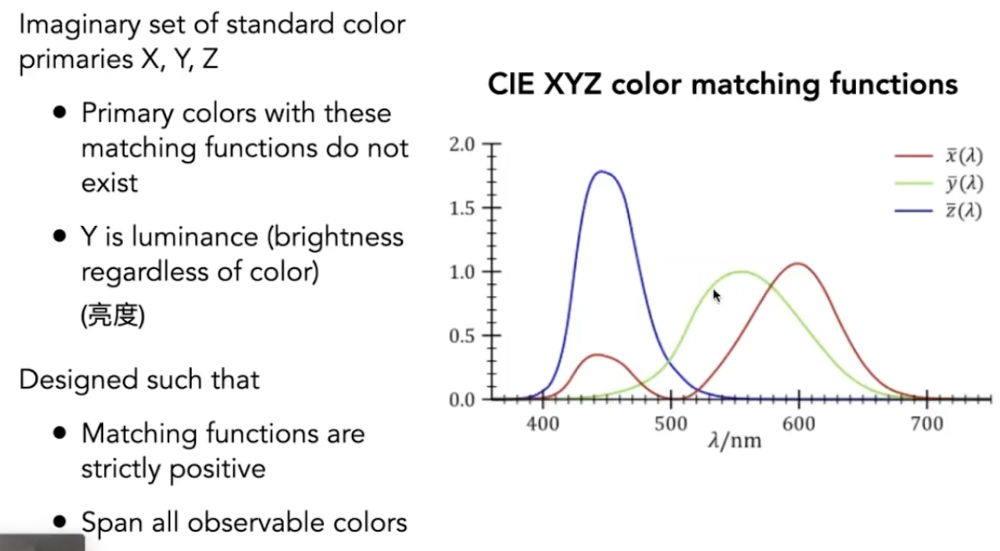
        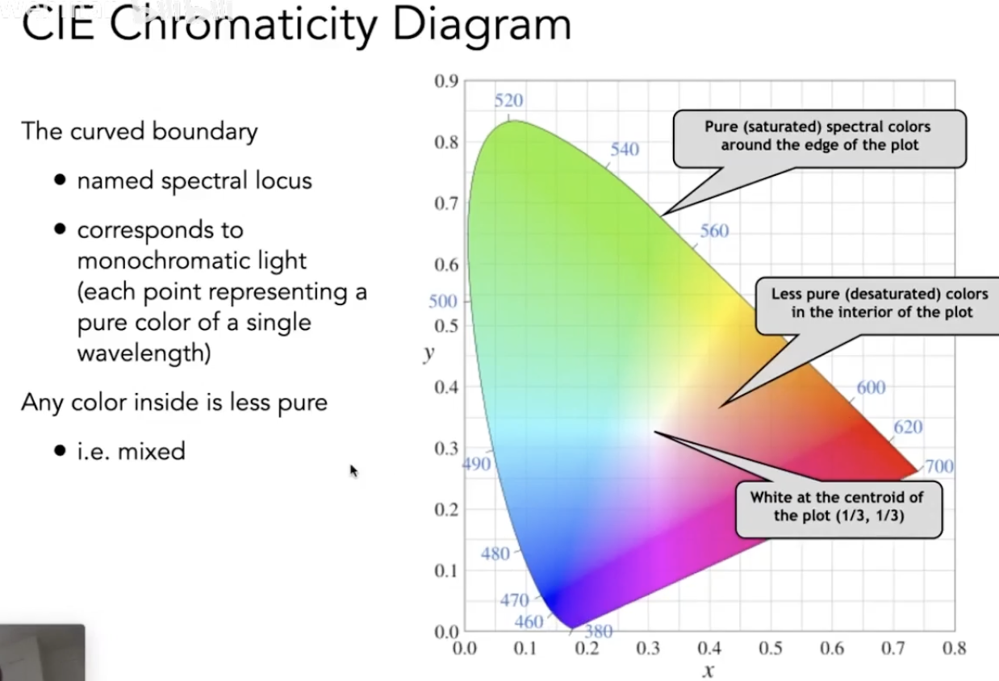

5. Color Space
   - Gamut 色域
     - Gamut is the set of chromaticities generated by a set of color primaries
     - Different color spaces represent different ranges of colors
     - So they have different gamuts, i.e. they cover different regions on the chromaticity diagram
        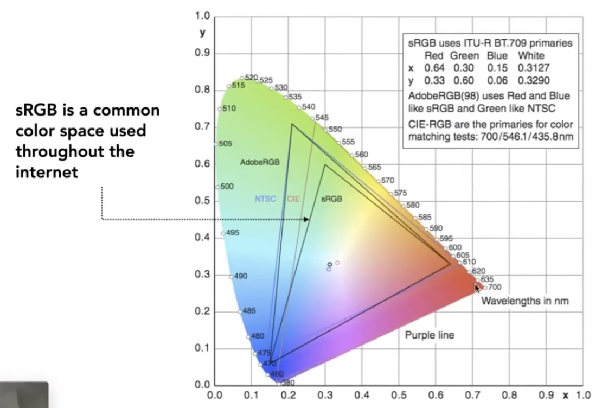
   - HSV Color Space (Hue-Saturation-Value)
     - Axes correspond to artistic characteristics of color
     - Widely used in a "color picker"
        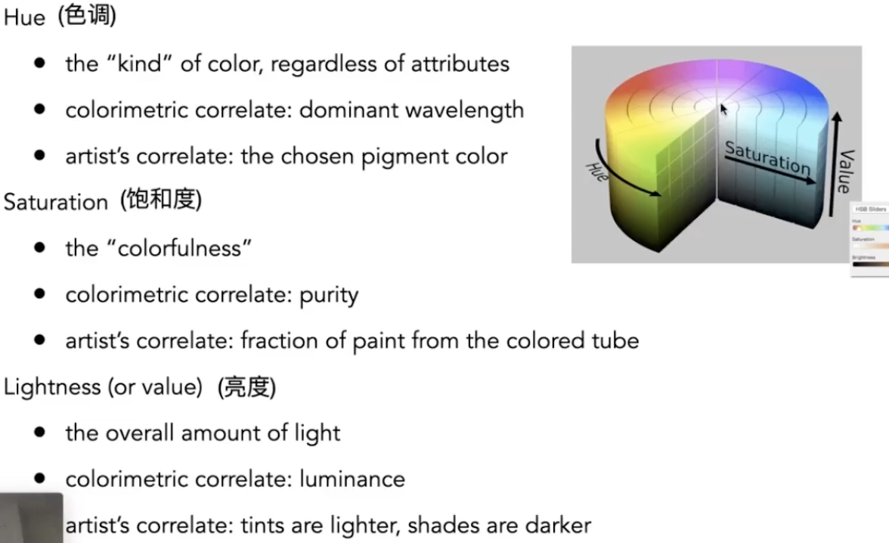
   - CIELAB Space 
     - A commonly used color space that strives for perceptual uniformity
     - $L^*$ is lightness/brightness
     - $a^*$ and $b^*$ are color-opponent pairs
       - $a^*$ is red-green
       - $b^*$ is blue-yellow 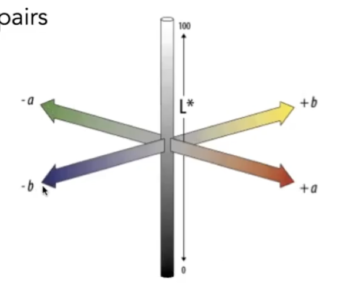
     - Opponent Color Theory 互补色
   - CMYK: A Subtractive Color Space
     - The more you mix, the darker it will be
     - Widely used in printing