# Lecture 21 Computer Animation

## History

1. animation
   - bring things to life
     - Communication tool
     - Aesthetic issues often dominate technical issues
   - An extension of modeling
     - Represent scene models as a function of time
   - Output: sequence of images that when viewed sequentially procide a sense of motion
     - Film: 24 frames per second
     - Video: 30 fps
     - Virtual reality: 90 fps

2. History
   - mural
   - Phenakistoscope
   - first film: Originally used as scientific tool rather than for entertainment
   - first hand-drawn feature-length (>40 mins) animation
   - first digital-computer-generated animation
   
## Keyframe animation

1. Animator creates keyframes; Assistant creates in-between frames (Tweening)
   - Keyframe Interpolation
    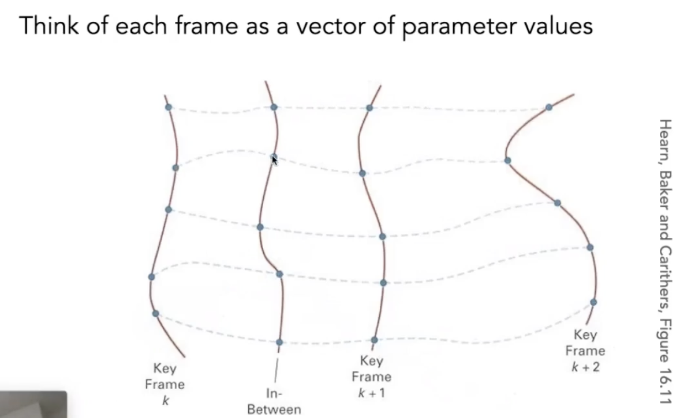
    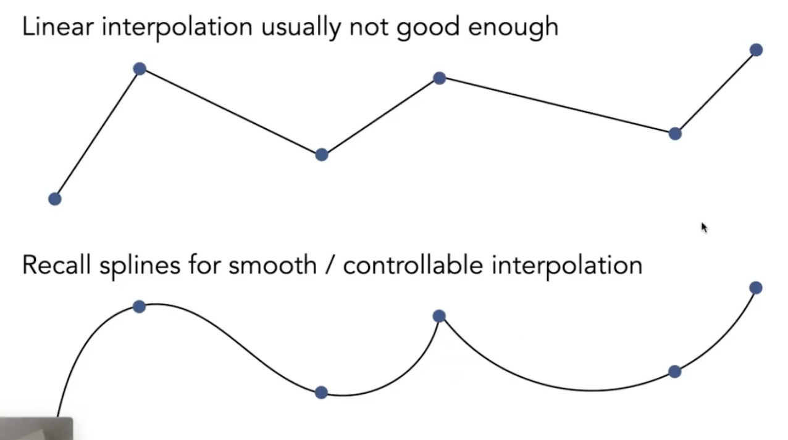

## Physical simulation

1. Newton's Law: $F=ma$
   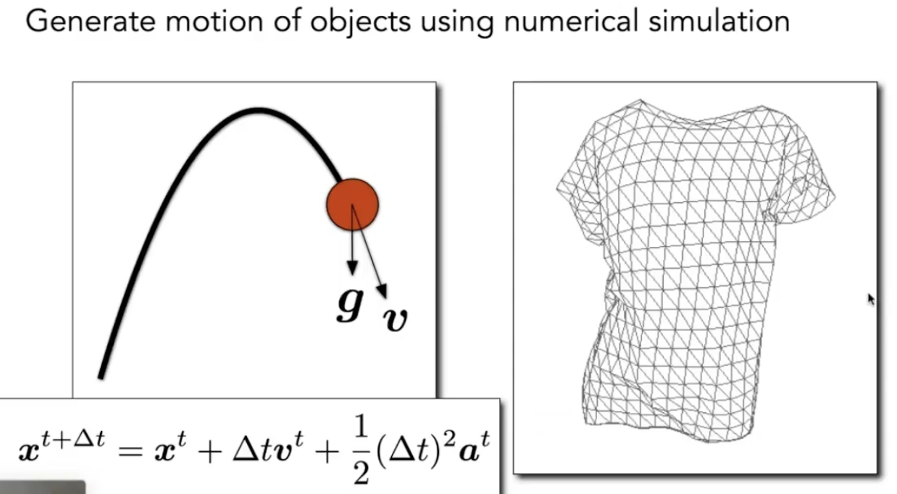

### Mass Spring System 质点弹簧系统
1. A simple spring
   - Idealized spring
     - Force pulls points together
     - Strength proportional to displacement (Hooke's Law)
     - $k_s$ is a spring coefficient: stiffness
     - Problem: this spring has zero length   
     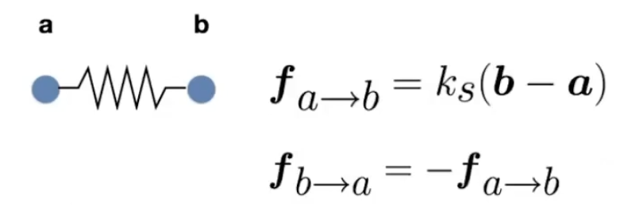
   - Spring with non-zero rest length
    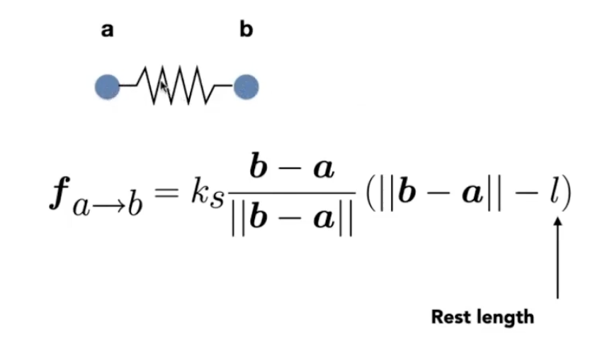
     - Problem: oscillates forever
   - Introducing Energy Loss
     - Simple motion damping 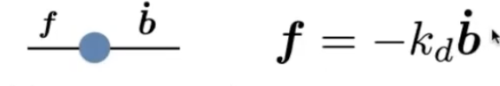
       - Behaves like viscous drag on motion
       - Slows down motion in the direction of velocity
       - $k_d$ is a damping coeffient
     - Dot Notation for Derivatives 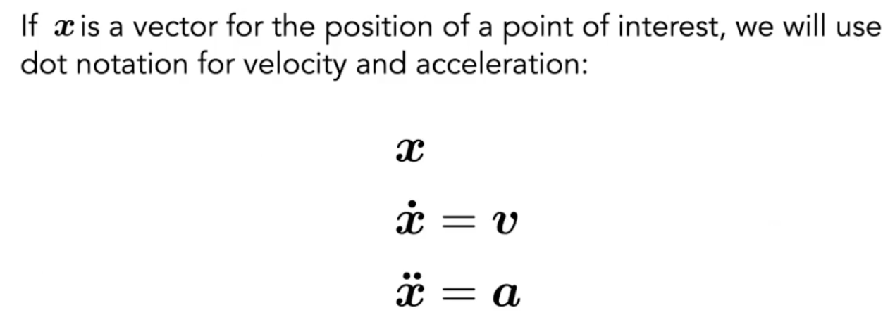
     - Problem: slows down all motion 无法表示弹簧内部的损耗
       - Want a rusty spring's oscillations to slow down, but should it also fall to the ground more slowly?
   - Internal Damping for Spring
     - Damp only the internal, spring-driven motion
      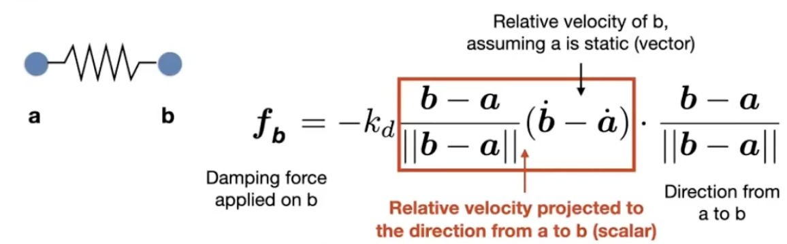
     - Viscous drag only on change in spring length
     - Won't slow group motion for the spring system (e.g. global translation or rotation of the group)
     - Note: This is pnly one specific type of damping

2. Structures from Springs 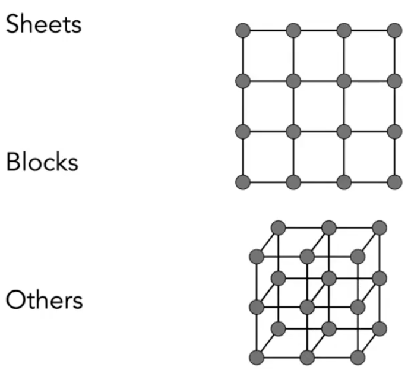
   - Behavior is determined by structure linkages
    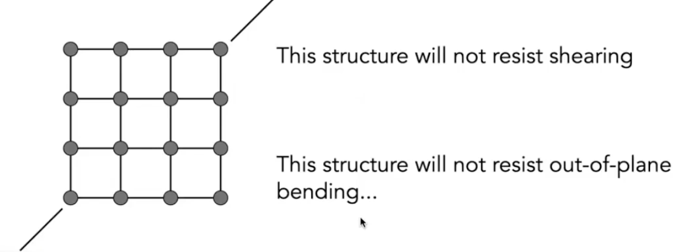
    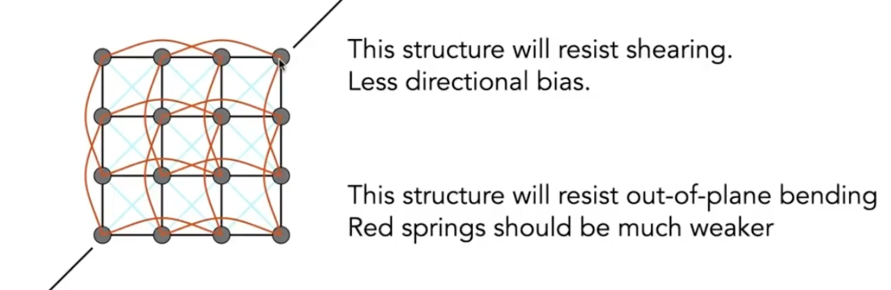

   - Aside: FEM(Finite Element Method) Instead of Springs

### Particle System 粒子系统

1. Model dynamical systems as collections of large numbers of particles
   - Each particle's motion is defined by a set of physical (or non-physical) forces
   - Popular technique in graphics and games
     - Easy to understand, implement
     - Scalable: fewer particles for speed, more for higher complexity 
   - Challenges
     - May need many particles (e.g. fluids)
     - May need acceleration structures (e.g. to find nearest particles for interactions)

2. For each frame in animation
   - [If needed] Create new particles
   - Calculate forces on each particle 
   - Update each particle's position and velocity
   - [If needed] Remove dead particles
   - Render particles

3. Particie System Forces
   - Attraction and repulsion forces
     - Gravity, electromagnetism, ...
     - Springs, propulsion, ...
   - Damping forces
     - Friction, air drag, viscosity, ...
   - Collisions
     - Walls, containers, fixed objects,...
     - Dynamic objects, character body parts, ...

4. Simulated Flocking as an ODE
   - Model each bird as a particle
   - Subject to very simple forces
     - attraction to center of neighbors
     - repulsion from individual neighbors
     - alignment toward average trajectory of neighbors
   - Simulate evolution of large particle system numerically
   - Emergent complex behavior (also seen in fish, bees, ...)
    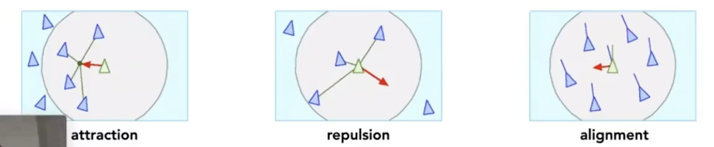

## Kinematrics 运动学

1. Forward Kinematics
   - Articulated skeleton
     - Topology (what is connected to what)
     - Geomrtric relations from joints
     - Tree structure (in absence of loops)
   - Joint types
     - Pin (1D rotation)
     - Ball (2D rotation)
     - Prismatic joint (translation)
        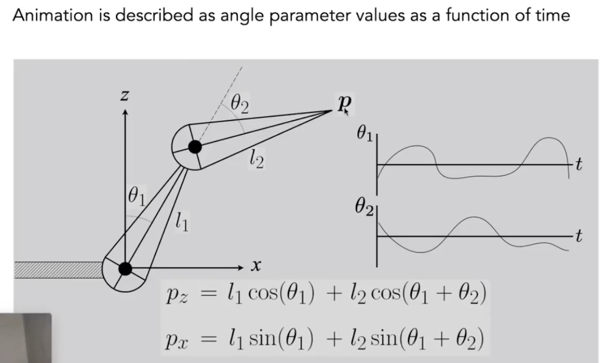
   - Pros
     - Direct control is convenient
     - Implementation is straightforward
   - Cons
     - Animation may be inconsistent with physics
     - Time consuming for artists

2. Inverse Kinematics
   - Why is the problem hard?
     - Multiple solutions in configuration space
     - Solutions may not always exist
   - Numerical solution to general N-link IK problem
     - Choose an initial configuration
     - Define an error metric (e.g. square of distance between goal and current position)
     - Compute gradient of error as function of configuration
     - Apply gradient descent (or Newton's method, or other optimization procedure)

## Rigging 木偶操控

1. Rigging is a set of higher level controls on a character that allow more rapid & intuitive modification of pose, deformations, expression, etc.
   - Like strings on a puppet 
   - Captures all meaningful character changes 
   - Varies from character to character

2. Blenc Shapes 
   - Instead of skeleton, interpolate directly between surfaces 
   - E.g., model a collection of facial expressions
   - Simplest scheme: take linear combination of vertex positions 
   - Spline used to control choice of weights over time

3. Motion Capture
   - Data-driven approach to creating animation sequences 
     - Record real-world performances (e.g. person executing an activity) 
     - Extract pose as a function of time from the data collected
   - Pros
     - Can capture large amounts of real data quickly
     - Realism can be high
   - Cons
     - Complex and costly set-ups
     - Captured animation may not meet artistic needs, requiring alterations
    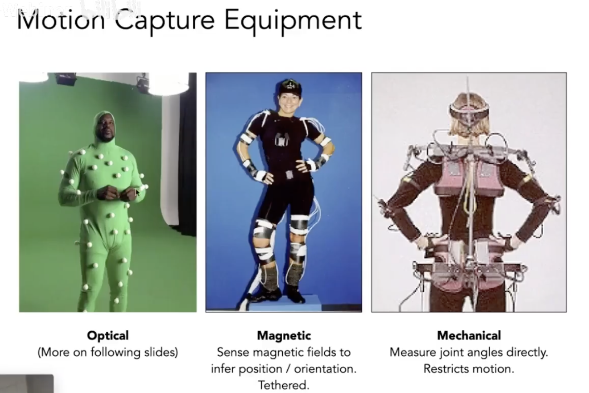
   - Optical Motion Capture
     - Markers on subject
     - Positions by triangulation from multiple cameras
     - 8+ cameras, 240 Hz, occlusions are difficult
        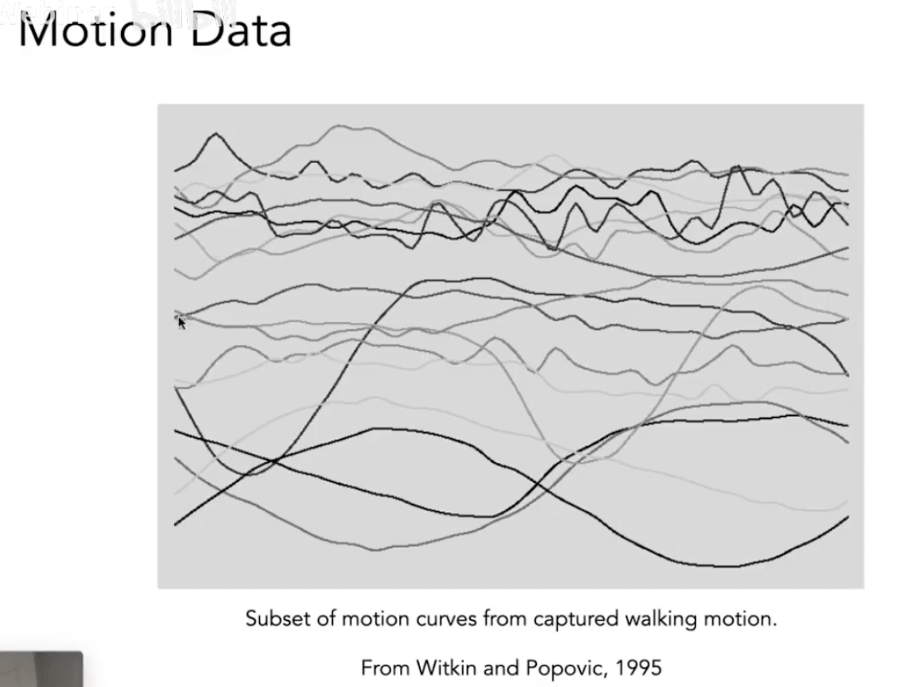

4. The Production Pipeline
   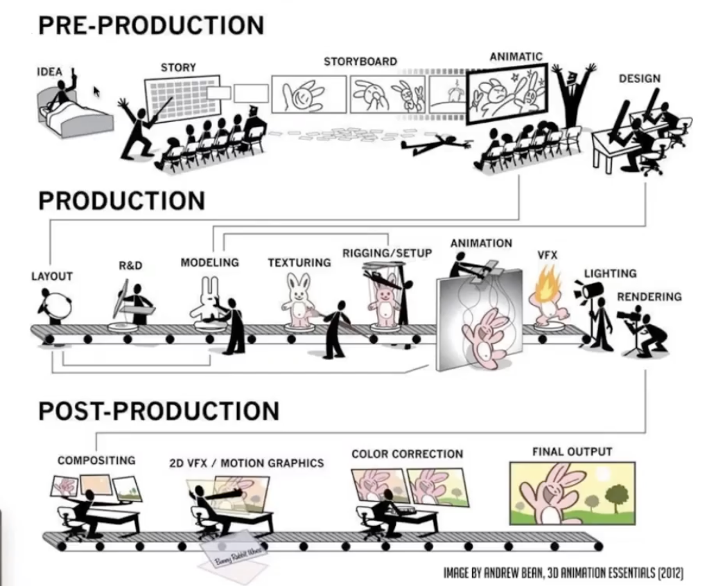