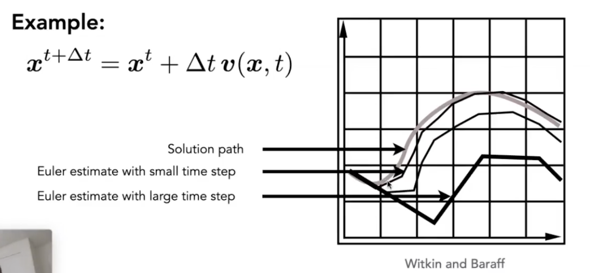

# Lecture 22 Animation cont.

## Single Particle Simulation

1. First study motion of a single particle
   - To start, assume motion of particle determined by a velocity vector field that is a function of position and time: $v(x,t)$
   - Computiong position of particle over time requires solving a first-order ordinary differential equation: $\frac{dx}{dt}=v(x,t)$
     - "First-order" refers to the first derivative being taken
     - "Ordinary" means no "partial" derivatives, i.e. x is just a function of t

2. Euler's Method (Forward Euler, Explicit Euler)
   - Simple iterative method
   - Commonly used
   - Very inaccurate -- Error
    
   - Most often goes unstable -- Instability
    

3. Some Methods to Combat Instability
   - Midpoint Method
     - Compute Euler step (a)
     - Compute derivative at midpoint of Euler step (b)
     - Update position using midpoint derivative (c)
        
        
   - Adaptive Step Size
     - Technique for choosing step size based on error estimate
     - Very practical technique
     - May need very small steps
     - Repeat until error is below threshold:
       - Compute $X_T$ an Euler step, size T
       - Compute $X_{T/2}$ two Euler steps, size T/2
       - Compute error $||X_T-X_{T/2}||$
       - if (error>threshold) reduce stepsize and try again
   - Implicit Euler Method
     - Informally called backward methods
     - Use derivatives in the future, for the current step
        
     - Solve nonlinear problem for $x^{t+\Delta t}$ and $x^{'t+\Delta t}$
     - Use root-finding algorithm, e.g. Newton's method
     - Offers much better stability

4. How to determine/quantize "stability" ?
   - We use the local truncation error (every step) / total accumulated error (overall)
   - Absolute values do not matter, but the orders w.r.t. step
   - Implicit Euler has order 1, which means that
     - Local truncation error: $O(h^2)$
     - Global truncation error: $O(h)$  (h is the step, i.e. $\Delta t$)
   - Understanding of O(h)
     - If we halve h, we can expect the error to halve as well
     - So the bigger O(), the more stability

5. Runge-Kutta Families
   - A family of advanced methods for solving ODEs
   - Especially good at dealing with non-linear
   - It's order-four version is the most widely used, a.k.a. RK4
      

6. Position-Based/Verlet Intergration
   - After modified Euler forward-step, constrain positions of particles to prevent divergent, unstable behavior
   - Use constrained positions to calculate velocity
   - Both of these ideas will dissipate energy, stabilize
   - Fast and simple
   - Not physically based, dissipates energy (error)

7. Rigid Body Simulation - a Simple case
   - Similar to simulating a particle
   - Just consider a bit more properties
    

8. Fluid Simulation - a Simple Position Based Method
   - Assuming water is composed of small rigid-body spheres
   - Assuming the water cannot be compressed (i.e. const. density)
   - So, as long as the density changes somewhere, it should be "corrected" via changing the position of particles
   - You need to know the gradient of the density anywhere w.r.t. each particle's position
   - Update by gradient descent

9. Eulerian vs. Lagrangian
    
   - Material Point Method (MPM)
     - Hybrid, combining Eulerian and Lagrangian views
       - Lagrangian: consider particles carrying material properties
       - Eulerian: use a grid to do numerical integration
     - Interaction: particles transfer properties to the grid, grid performs update, then interpolate back to particles